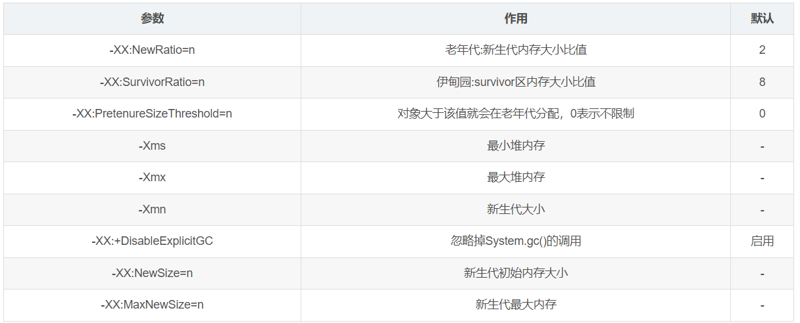

# 垃圾回收

可以作为**GC Root**的对象就是那些永远不会被当成垃圾回收的对象

//关联了引用队列,当软引用所关联的byte数组被回收时，软引用自己就会加入到引用队列queue中去

新生代空间不足触发Minor GC后，幸存区不足以存放存活的新生代，这时候会部分新生代的对象提前晋升老年代（分配担保），晋升后发现老年代空间不足，这时候会触发Full GC，接前面红字(需要注意的是CMS收集器会有单独收集老年代的的行为Major GC/ Old GC)。（继续接红字）当对象的寿命达到15时，会晋升老年代，如果老年代不足，这时候会触发Full GC (需要注意的是CMS收集器会有单独收集老年代的的行为Major GC/ Old GC)。

当新生代空间不足时，也可直接晋升老年代

当一个线程抛出OOM异常后，它所占据的内存资源会全部被释放掉，从而不会影响其他线程的运行

串行垃圾回收，首先要让所有线程全都停下来，因为垃圾回收时，对象的地址可能会变化，可能会导致其他线程找不到对象

初始标记是找到所有的gc root对象也就是根对象最终标记是标记其他对象

