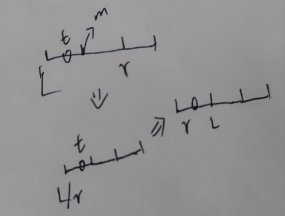
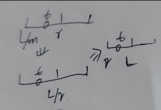
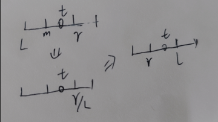

刷题的心得
  ## 二分查找
[题目链接](https://leetcode.cn/problems/search-insert-position/ "hahaha")
> 二分查找所需要的条件:
> * 用于查找的内容**逻辑**上来说是需要**有序**的（不一定是数学上的有序，就像一堆硬币中查找假币，只要逻辑上有序即可）
> * 查找的数量只能是<u>**一个**</u>，而不是多个
> * 只要可以得到一个范围，就可以使用二分查找，就像愤怒的牛这一题，得到一个范围，最小的范围就是相距为零，最大的范围就是相距为（nums[n-1]-nums[n]），然后每次取中间值，判断用中间值作为答案，最后能用的牛圈是不是大于牛的个数，满足就说明这个中间值小了，反之，就大了。

>常见区间条件：
>* 左闭右开：[left, right)，跳出条件一定为left == right
>* 左闭右闭：[left, right]，跳出条件一定为left > right
其中的范围指得是检索的范围，左闭右闭指的是左边界和右边界都有可能是要找的元素，左闭右开，指的是左边界是而右边界已经被排除可能性。
```Cpp
int search(int* nums, int numsSize, int target){
    if (nums == NULL) return -1;
    int left = 0;
    int right = numsSize - 1; // 左闭右闭区间

    while (left <= right) {
        int mid = left + (right - left) / 2;
        //防止溢出，如果right，left很大直接相加可能会溢出，所以用这种方法可以防止溢出
        if (nums[mid] == target) {
            return mid;
        } else if (nums[mid] < target) {
            left = mid + 1;
        } else if (nums[mid] > target) {
            right = mid - 1;
        }
    }
    return -1; // 遍历完未找到
}


// 输入：升序数组，数组大小及待查找的目标
// 输出：若查找到，则返回对应下标；否则返回-1
int binarySearch(int *nums, int numsSize, int target)
{
    int left = 0;
    int right = numsSize;
    int mid;
    while (left < right) {
        mid = left + (right - left) / 2;
        if (nums[mid] == target) {
            return mid; // 若找到
        } else if (nums[mid] < target) { // 左侧区间右移
            left = mid + 1;
        } else if (nums[mid] > target) { // 右侧区间左移
            right = mid;
        }
    }
    return -1; // 没找到，则返回-1
}

```
#### 应用寻找上下（左右）边界
```c++
int searchInsert(int* nums, int numsSize, int target) 
{//寻找左边界
    int left = 0, right = numsSize - 1;
    while (left <= right) 
    {
        int mid = ((right - left) >> 1) + left;
        if (target <= nums[mid])   // 找到第一个小于target的数
        {
            right = mid - 1;
        } 
        else 
        {
            left = mid + 1;
        }
    }
    return left;
}
```
//如果要找右边界只需要把target <= nums[mid] $\Rightarrow$  target < nums[mid]     

#### 总结
>* 如果找到就直接返回
  >* 若果没有找到，left是在左边逐步靠近目标值最后超过目标值，right在右边，最后小于目标值，而且left和right恰好在离目标值最近的地方left在右，right在左
  
   
  
>接上文，在图中可以看到具体没有找到L和r是怎么变化的最终会将目标围起来按照情况进行返回Left或者Right。重合之前left和right的位置一定是分别在左右。
>* 左闭右开也是类似，由于right只有赋值给middle的操作没有+-1。所以right一定始终在目标值右边，因为如果middle>target right会靠过去，而保证不会超过去所以最后left和right的重合点一定是在目标点右边，根据情况返回即可。
>* 自己的理解不是将left和right当作区间看待，而是把它当作两个逐步靠近目标值的标记，跳出别人说的区间不然很难想象毕竟结果大多数情况下只需要返回left或right
