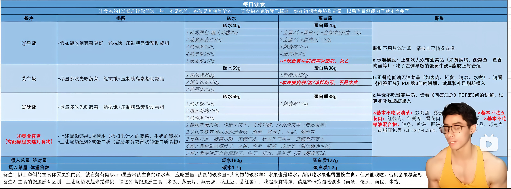

# 减肥大计

开合跳60秒

勾腿跳60秒

深蹲30个

胯下击掌60秒

提拳60秒

弓步深蹲30个

深蹲触地30个

俯身登山跑30秒

# 回调，异步，多线程

回调函数是一种机制，函数指针是一种实现，在没有指针的语言里也一样可以有回调函数

[回调函数与异步 - 知乎 (zhihu.com)](https://zhuanlan.zhihu.com/p/491684301)

回调函数和异步没有关系。

[什么是异步？异步就是多线程吗？异步就是 async、await 吗？ | Kit Lau's Blog](https://blog.kitlau.dev/posts/what-is-asynchronous-is-it-multi-threading-or-async-await/)

背景：作为一个北漂，准备结束北漂生涯，谋划如何搬家。其余家当都变买了，就剩下有一辆小轿车，和一辆摩托车需要带回家。

  \1. 阻塞式编程：先开其中一辆回去，再回来开另一辆车回去。

  \2. 传统异步式编程：摩托车办理快递，我开汽车回去。注意，快递公司派件（回调）时我不一定已经开车到家，如果必须本人签收，就比较麻烦了。----此种通过回调进行异步编程的方式，没法编写符合思维顺序的代码。

  \3. 基于多线程的异步编程：我获得了瞬间移动的超能力（cpu计算速度提升），以毫秒级的速度在汽车与摩托车之间切换驾驶。汽车（主线程）上有车载电话，可以使用处理其它事情。----期间频繁的上下文切换，会造成额外的损耗，造成反应能力比较差，只能开到60迈。

  4.并行编程：我获得了分身的超能力（多核cpu的出现），两个我同时开两辆车回家。----充分发挥了cpu的能力，没有额外切换上下文的损耗，精力充沛，在120的时速狂飙。
链接：https://www.zhihu.com/question/28550867/answer/450069610

同步异步与阻塞非阻塞是两个概念吧，同步异步表示的结果的获取方式是主动获取还是被动接收；阻塞非阻塞表示的是获取这个动作是否可以立即返回不用等待。[从小白到高手，你需要理解同步与异步 - 知乎 (zhihu.com)](https://zhuanlan.zhihu.com/p/270428703)

[Java实现异步编程的8种方式 - 掘金 (juejin.cn)](https://juejin.cn/post/7165147306688249870)

多线程只是实现异步的一种手段[一篇文章，搞懂异步和多线程的区别 - 知乎 (zhihu.com)](https://zhuanlan.zhihu.com/p/350816301)

回调也可以用来实现异步编程。链接：https://www.zhihu.com/question/58423131/answer/2994092071

在 Java 中，实现异步操作的方式背后通常都会涉及到多线程的运行。无论是使用线程池、回调函数、Future/CompletableFuture 还是定时器，它们最终都会使用多个线程来执行异步任务。即使在单线程的情况下，通过这些方式实现的异步操作，背后仍然依赖于多线程的支持。（chatgpt）

同步/异步关注的是消息通知的机制，而阻塞/非阻塞关注的是程序（线程）等待消息通知时的状态。[同步、异步、阻塞、非阻塞 - 知乎 (zhihu.com)](https://zhuanlan.zhihu.com/p/88403724)

# 自定义排序

[java中Comparator比较器顺序问题，源码分析 - 只爱东山晴后雪 - 博客园 (cnblogs.com)](https://www.cnblogs.com/maozp/p/11153403.html)

[Java中自定义排序的几种方式_java自定义排序-CSDN博客](https://blog.csdn.net/qq_57014268/article/details/119816690)

[Java中自定义排序的几种方式_java自定义排序-CSDN博客](https://blog.csdn.net/qq_57014268/article/details/119816690)

> 当元素的类型没有实现java.lang.Comparable接口而又不方便修改代码，或者实现了java.lang.Comparable接口的排序规则不适合当前的操作可以考虑使用Comparator的对象来实现排序。
>
> Comparable接口与Comparator接口的使用对比
>
> * Comparable接口的方式一旦指定，保证Comparable接口实现类的对象在任何位置都可以比较大小。
>
> * Comparator接口属于临时性的比较。

