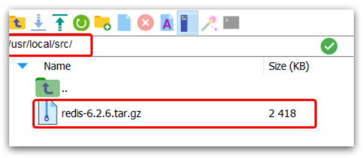
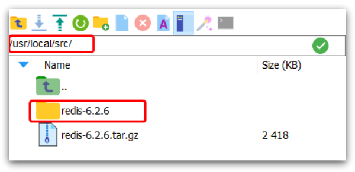
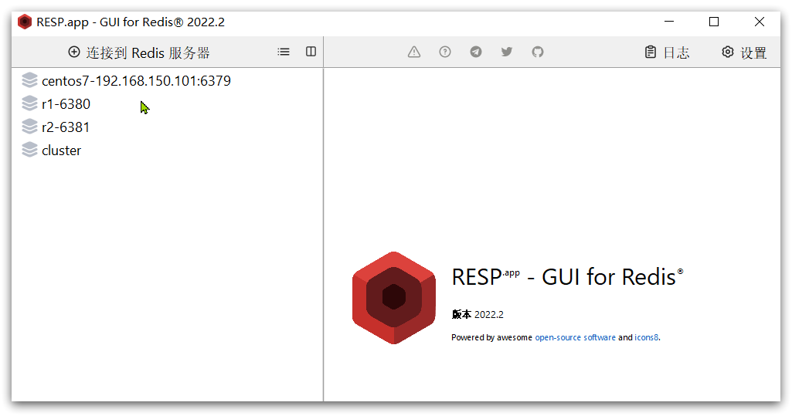
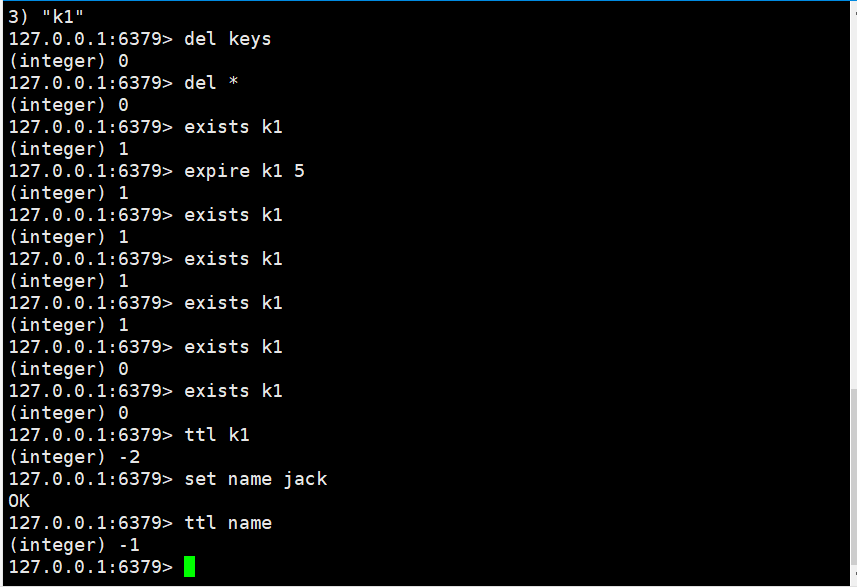
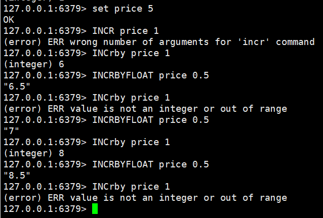
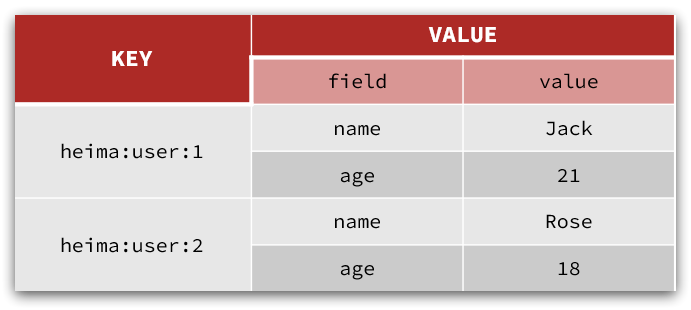
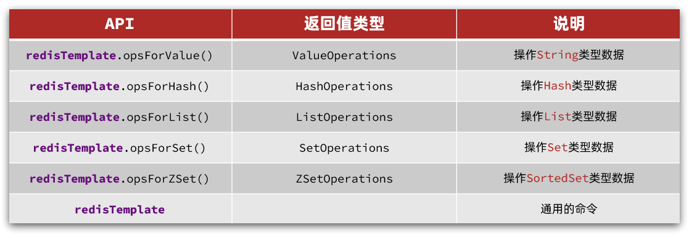
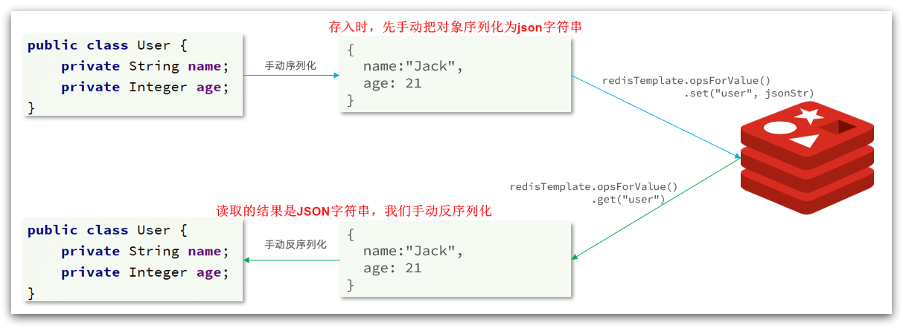

# Redis快速入门

Redis的常见命令和客户端使用


# 1.初识Redis

Redis是一种键值型的NoSql数据库，这里有两个关键字：

- 键值型

- NoSql

其中**键值型**，是指Redis中存储的数据都是以key、value对的形式存储，而value的形式多种多样，可以是字符串、数值、甚至json：


而NoSql则是相对于传统关系型数据库而言，有很大差异的一种数据库。


## 1.1.认识NoSQL

**NoSql**可以翻译做Not Only Sql（不仅仅是SQL），或者是No Sql（非Sql的）数据库。是相对于传统关系型数据库而言，有很大差异的一种特殊的数据库，因此也称之为**非关系型数据库**。


### 1.1.1.结构化与非结构化

传统关系型数据库是结构化数据，每一张表都有严格的约束信息：字段名、字段数据类型、字段约束等等信息，插入的数据必须遵守这些约束：


而NoSql则对数据库格式没有严格约束，往往形式松散，自由。

可以是键值型：


也可以是文档型：


甚至可以是图格式：


### 1.1.2.关联和非关联

传统数据库的表与表之间往往存在关联，例如外键：


而非关系型数据库不存在关联关系，要维护关系要么靠代码中的业务逻辑，要么靠数据之间的耦合：

```json
{
  id: 1,
  name: "张三",
  orders: [
    {
       id: 1,
       item: {
	 id: 10, title: "荣耀6", price: 4999
       }
    },
    {
       id: 2,
       item: {
	 id: 20, title: "小米11", price: 3999
       }
    }
  ]
}
```

此处要维护“张三”的订单与商品“荣耀”和“小米11”的关系，不得不冗余的将这两个商品保存在张三的订单文档中，不够优雅。还是建议用业务来维护关联关系。


### 1.1.3.查询方式

传统关系型数据库会基于Sql语句做查询，语法有统一标准；

而不同的非关系数据库查询语法差异极大，五花八门各种各样。


### 1.1.4.事务

传统关系型数据库能满足事务ACID的原则。


而非关系型数据库往往不支持事务，或者不能严格保证ACID的特性，只能实现基本的一致性。


### 1.1.5.总结

### ⭐

结构化：总结来说就是nosql存储的数据没有一种固定的结构。

关联化：nosql数据之间的关联需要程序员自己通过业务逻辑维护而不是数据库会自动维护两张表之间的关系。

查询方式：对应关系型数据库，它们的查询语句有固定的格式和标准，所以不同的关系型数据库如MySQL和Oracle之间的查询语句差异不大，而非关系型数据库之间的查询语句差异较大，没有一个固定的格式。

事务：非关系型数据库往往不支持事务，或者不能严格保证ACID的特性，只能实现基本的一致性。

除了上述四点以外，在存储方式、扩展性、查询性能上关系型与非关系型也都有着显著差异，总结如下：


- 存储方式
  - 关系型数据库基于磁盘进行存储，会有大量的磁盘IO，对性能有一定影响
  - 非关系型数据库，他们的操作更多的是依赖于内存来操作，内存的读写速度会非常快，性能自然会好一些

* 扩展性
  * 关系型数据库集群模式一般是主从，主从数据一致，起到数据备份的作用，称为垂直扩展。
  * 非关系型数据库可以将数据拆分，存储在不同机器上，可以保存海量数据，解决内存大小有限的问题。称为水平扩展。
  * 关系型数据库因为表之间存在关联关系，如果做水平扩展会给数据查询带来很多麻烦


## 1.2.认识Redis

Redis诞生于2009年全称是**Re**mote  **D**ictionary **S**erver 远程词典服务器，是一个基于内存的键值型NoSQL数据库。

**特征**：

- 键值（key-value）型，value支持多种不同数据结构，功能丰富
- 单线程，每个命令具备原子性
- 低延迟，速度快（基于内存、IO多路复用、良好的编码）。
- 支持数据持久化
- 支持主从集群、分片集群
- 支持多语言客户端

**作者**：Antirez

Redis的官方网站地址：https://redis.io/


## 1.3.安装Redis

大多数企业都是基于Linux服务器来部署项目，而且Redis官方也没有提供Windows版本的安装包。因此课程中我们会基于Linux系统来安装Redis.

此处选择的Linux版本为CentOS 7.

### 1.3.1.依赖库

Redis是基于C语言编写的，因此首先需要安装Redis所需要的gcc依赖：

```sh
yum install -y gcc tcl
```


### 1.3.2.上传安装包并解压

然后将课前资料提供的Redis安装包上传到虚拟机的任意目录：


例如，我放到了/usr/local/src 目录：



解压缩：

```sh
tar -xzf redis-6.2.6.tar.gz
```

解压后：



进入redis目录：

```sh
cd redis-6.2.6
```


运行编译命令：

```sh
make && make install
```

如果没有出错，应该就安装成功了。


默认的安装路径是在 目录下：


该目录已经默认配置到环境变量，因此可以在任意目录下运行这些命令。其中：

- redis-cli：是redis提供的命令行客户端
- redis-server：是redis的服务端启动脚本
- redis-sentinel：是redis的哨兵启动脚本


### 1.3.3.启动

redis的启动方式有很多种，例如：

- 默认启动
- 指定配置启动
- 开机自启


### 1.3.4.默认启动

安装完成后，在任意目录输入redis-server命令即可启动Redis：

```
redis-server
```

如图：


这种启动属于`前台启动`，会阻塞整个会话窗口，窗口关闭或者按下`CTRL + C`则Redis停止。不推荐使用。

### 1.3.5.指定配置启动

如果要让Redis以`后台`方式启动，则必须修改Redis配置文件，就在我们之前解压的redis安装包下（`/usr/local/src/redis-6.2.6`），名字叫redis.conf：


我们先将这个配置文件备份一份：

```
cp redis.conf redis.conf.bck
```


然后修改redis.conf文件中的一些配置：

```properties
# 允许访问的地址，默认是127.0.0.1，会导致只能在本地访问。修改为0.0.0.0则可以在任意IP访问，生产环境不要设置为0.0.0.0
bind 0.0.0.0
# 守护进程，修改为yes后即可后台运行
daemonize yes 
# 密码，设置后访问Redis必须输入密码
requirepass 123321
```


Redis的其它常见配置：

```properties
# 监听的端口
port 6379
# 工作目录，默认是当前目录，也就是运行redis-server时的命令，日志、持久化等文件会保存在这个目录
dir .
# 数据库数量，设置为1，代表只使用1个库，默认有16个库，编号0~15
databases 1
# 设置redis能够使用的最大内存
maxmemory 512mb
# 日志文件，默认为空，不记录日志，可以指定日志文件名
logfile "redis.log"
```


启动Redis：

```sh
# 进入redis安装目录 
cd /usr/local/src/redis-6.2.6
# 启动
redis-server redis.conf
```


停止服务：

```sh
# 利用redis-cli来执行 shutdown 命令，即可停止 Redis 服务，
# 因为之前配置了密码，因此需要通过 -u 来指定密码
redis-cli -u 123321 shutdown
```


### 1.3.6.开机自启

我们也可以通过配置来实现开机自启。

首先，新建一个系统服务文件：

```sh
vi /etc/systemd/system/redis.service
```

内容如下：

```conf
[Unit]
Description=redis-server
After=network.target

[Service]
Type=forking
ExecStart=/usr/local/bin/redis-server /usr/local/src/redis-6.2.6/redis.conf
PrivateTmp=true

[Install]
WantedBy=multi-user.target
```


然后重载系统服务：

```sh
systemctl daemon-reload
```


现在，我们可以用下面这组命令来操作redis了：

```sh
# 启动
systemctl start redis
# 停止
systemctl stop redis
# 重启
systemctl restart redis
# 查看状态
systemctl status redis
```


执行下面的命令，可以让redis开机自启：

```sh
systemctl enable redis
```


## 1.4.Redis桌面客户端

安装完成Redis，我们就可以操作Redis，实现数据的CRUD了。这需要用到Redis客户端，包括：

- 命令行客户端
- 图形化桌面客户端
- 编程客户端

### 1.4.1.Redis命令行客户端

Redis安装完成后就自带了命令行客户端：redis-cli，使用方式如下：

```sh
redis-cli [options] [commonds]
```

其中常见的options有：

- `-h 127.0.0.1`：指定要连接的redis节点的IP地址，默认是127.0.0.1
- `-p 6379`：指定要连接的redis节点的端口，默认是6379
- `-a 123321`：指定redis的访问密码 

其中的commonds就是Redis的操作命令，例如：

- `ping`：与redis服务端做心跳测试，服务端正常会返回`pong`

不指定commond时，会进入`redis-cli`的交互控制台：


### 1.4.2.图形化桌面客户端

GitHub上的大神编写了Redis的图形化桌面客户端，地址：https://github.com/uglide/RedisDesktopManager

不过该仓库提供的是RedisDesktopManager的源码，并未提供windows安装包。


在下面这个仓库可以找到安装包：https://github.com/lework/RedisDesktopManager-Windows/releases


### 1.4.3.安装

在课前资料中可以找到Redis的图形化桌面客户端：


解压缩后，运行安装程序即可安装：


安装完成后，在安装目录下找到rdm.exe文件：


双击即可运行：




### 1.4.4.建立连接

点击左上角的`连接到Redis服务器`按钮：


在弹出的窗口中填写Redis服务信息：


点击确定后，在左侧菜单会出现这个链接：


点击即可建立连接了。


Redis默认有16个仓库，编号从0至15.  通过配置文件可以设置仓库数量，但是不超过16，并且不能自定义仓库名称。

如果是基于redis-cli连接Redis服务，可以通过select命令来选择数据库：

```sh
# 选择 0号库
select 0
```


# 2.Redis常见命令

Redis是典型的key-value数据库，key一般是字符串，而value包含很多不同的数据类型：


Redis为了方便我们学习，将操作不同数据类型的命令也做了分组，在官网（ [https://redis.io/commands ](https://redis.io/commands)）可以查看到不同的命令：


不同类型的命令称为一个group，我们也可以通过help命令来查看各种不同group的命令：


接下来，我们就学习常见的五种基本数据类型的相关命令。


## 2.1.Redis通用命令

通用指令是部分数据类型的，都可以使用的指令，常见的有：

- KEYS：查看符合模板的所有key
- DEL：删除一个指定的key
- EXISTS：判断key是否存在
- EXPIRE：给一个key设置有效期，有效期到期时该key会被自动删除
- TTL：查看一个KEY的剩余有效期

### ⭐

以秒为单位，如果不设置key的有效期，那么他的有效期就为-1，意思是永久有效。如果是过期，查看的返回值就是-2



通过help [command] 可以查看一个命令的具体用法，例如：

```sh
# 查看keys命令的帮助信息：
127.0.0.1:6379> help keys

KEYS pattern
summary: Find all keys matching the given pattern
since: 1.0.0
group: generic
```


## 2.2.String类型

String类型，也就是字符串类型，是Redis中最简单的存储类型。

其value是字符串，不过根据字符串的格式不同，又可以分为3类：

- string：普通字符串
- int：整数类型，可以做自增、自减操作
- float：浮点类型，可以做自增、自减操作

不管是哪种格式，底层都是字节数组形式存储，只不过是编码方式不同。字符串类型的最大空间不能超过512m.


### 2.2.1.String的常见命令

String的常见命令有：

- SET：添加或者修改已经存在的一个String类型的键值对
- GET：根据key获取String类型的value
- MSET：批量添加多个String类型的键值对
- MGET：根据多个key获取多个String类型的value
- INCR：让一个整型的key自增1
- INCRBY:让一个整型的key自增并指定步长，例如：incrby num 2 让num值自增2
- INCRBYFLOAT：让一个浮点类型的数字自增并指定步长
- SETNX：添加一个String类型的键值对，前提是这个key不存在，否则不执行
  * set name rose nx  <==>  setnx name rose 

- SETEX：添加一个String类型的键值对，并且指定有效期
  - setex name 10 rose  <==>  set name rose ex 10  <\==>  set name rose +  exquire name 10 



### 2.2.2.Key结构

Redis没有类似MySQL中的Table的概念，我们该如何区分不同类型的key呢？

例如，需要存储用户、商品信息到redis，有一个用户id是1，有一个商品id恰好也是1，此时如果使用id作为key，那就会冲突了，该怎么办？

我们可以通过给key添加前缀加以区分，不过这个前缀不是随便加的，有一定的规范：

Redis的key允许有多个单词形成层级结构，多个单词之间用':'隔开，格式如下：

```
	项目名:业务名:类型:id
```

这个格式并非固定，也可以根据自己的需求来删除或添加词条。这样以来，我们就可以把不同类型的数据区分开了。从而避免了key的冲突问题。

例如我们的项目名称叫 heima，有user和product两种不同类型的数据，我们可以这样定义key：

- user相关的key：**heima:user:1**

- product相关的key：**heima:product:1**


如果Value是一个Java对象，例如一个User对象，则可以将对象序列化为JSON字符串后存储：

| **KEY**         | **VALUE**                                  |
| --------------- | ------------------------------------------ |
| heima:user:1    | {"id":1,  "name": "Jack", "age": 21}       |
| heima:product:1 | {"id":1,  "name": "小米11", "price": 4999} |

并且，在Redis的桌面客户端中，还会以相同前缀作为层级结构，让数据看起来层次分明，关系清晰：


## 2.3.Hash类型

Hash类型，也叫散列，其value是一个无序字典，类似于Java中的HashMap结构。

String结构是将对象序列化为JSON字符串后存储，当需要修改对象某个字段时很不方便：


Hash结构可以将对象中的每个字段独立存储，可以针对单个字段做CRUD：



Hash的常见命令有：

- HSET key field value：添加或者修改hash类型key的field的值

- HGET key field：获取一个hash类型key的field的值

- HMSET：批量添加多个hash类型key的field的值

- HMGET：批量获取多个hash类型key的field的值

- HGETALL：获取一个hash类型的key中的所有的field和value
- HKEYS：获取一个hash类型的key中的所有的field
- HINCRBY:让一个hash类型key的字段值自增并指定步长
- HSETNX：添加一个hash类型的key的field值，前提是这个field不存在，否则不执行


## 2.4.List类型

Redis中的List类型与Java中的LinkedList类似，可以看做是一个双向链表结构。既可以支持正向检索和也可以支持反向检索。

特征也与LinkedList类似：

- 有序
- 元素可以重复
- 插入和删除快
- 查询速度一般

常用来存储一个有序数据，例如：朋友圈点赞列表，评论列表等。


List的常见命令有：

- LPUSH key element ... ：向列表左侧插入一个或多个元素
- LPOP key：移除并返回列表左侧的第一个元素，没有则返回nil
- RPUSH key element ... ：向列表右侧插入一个或多个元素
- RPOP key：移除并返回列表右侧的第一个元素
- LRANGE key star end：返回一段角标范围内的所有元素
- BLPOP和BRPOP：与LPOP和RPOP类似，只不过在没有元素时等待指定时间，而不是直接返回nil


## 2.5.Set类型

Redis的Set结构与Java中的HashSet类似，可以看做是一个value为null的HashMap。因为也是一个hash表，因此具备与HashSet类似的特征：

- 无序

- 元素不可重复

- 查找快

- 支持交集、并集、差集等功能


Set的常见命令有：

- SADD key member ... ：向set中添加一个或多个元素
- SREM key member ... : 移除set中的指定元素
- SCARD key： 返回set中元素的个数
- SISMEMBER key member：判断一个元素是否存在于set中
- SMEMBERS：获取set中的所有元素
- SINTER key1 key2 ... ：求key1与key2的交集


例如两个集合：s1和s2:


求交集：SINTER s1 s2

求s1与s2的不同：SDIFF s1 s2


练习：

1. 将下列数据用Redis的Set集合来存储：

- 张三的好友有：李四、王五、赵六
- 李四的好友有：王五、麻子、二狗

2. 利用Set的命令实现下列功能：

- 计算张三的好友有几人
- 计算张三和李四有哪些共同好友
- 查询哪些人是张三的好友却不是李四的好友
- 查询张三和李四的好友总共有哪些人
- 判断李四是否是张三的好友
- 判断张三是否是李四的好友
- 将李四从张三的好友列表中移除


## 2.6.SortedSet类型

Redis的SortedSet是一个可排序的set集合，与Java中的TreeSet有些类似，但底层数据结构却差别很大。SortedSet中的每一个元素都带有一个score属性，可以基于score属性对元素排序，底层的实现是一个跳表（SkipList）加 hash表。

SortedSet具备下列特性：

- 可排序
- 元素不重复
- 查询速度快

因为SortedSet的可排序特性，经常被用来实现排行榜这样的功能。


SortedSet的常见命令有：

- ZADD key score member：添加一个或多个元素到sorted set ，如果已经存在则更新其score值
- ZREM key member：删除sorted set中的一个指定元素
- ZSCORE key member : 获取sorted set中的指定元素的score值
- ZRANK key member：获取sorted set 中的指定元素的排名
- ZCARD key：获取sorted set中的元素个数
- ZCOUNT key min max：统计score值在给定范围内的所有元素的个数
- ZINCRBY key increment member：让sorted set中的指定元素自增，步长为指定的increment值
- ZRANGE key min max：按照score排序后，获取指定排名范围内的元素
- ZRANGEBYSCORE key min max：按照score排序后，获取指定score范围内的元素
- ZDIFF、ZINTER、ZUNION：求差集、交集、并集

注意：所有的排名默认都是升序，如果要降序则在命令的Z后面添加REV即可，例如：

- **升序**获取sorted set 中的指定元素的排名：ZRANK key member

- **降序**获取sorted set 中的指定元素的排名：ZREVRANK key memeber


练习题：

将班级的下列学生得分存入Redis的SortedSet中：

Jack 85, Lucy 89, Rose 82, Tom 95, Jerry 78, Amy 92, Miles 76

并实现下列功能：

- 删除Tom同学
- 获取Amy同学的分数
- 获取Rose同学的排名
- 查询80分以下有几个学生
- 给Amy同学加2分
- 查出成绩前3名的同学
- 查出成绩80分以下的所有同学


# 3.Redis的Java客户端

在Redis官网中提供了各种语言的客户端，地址：https://redis.io/docs/clients/


其中Java客户端也包含很多：


标记为*的就是推荐使用的java客户端，包括：

- Jedis和Lettuce：这两个主要是提供了Redis命令对应的API，方便我们操作Redis，而SpringDataRedis又对这两种做了抽象和封装，因此我们后期会直接以SpringDataRedis来学习。
- Redisson：是在Redis基础上实现了分布式的可伸缩的java数据结构，例如Map、Queue等，而且支持跨进程的同步机制：Lock、Semaphore等待，比较适合用来实现特殊的功能需求。


## 3.1.Jedis客户端

Jedis的官网地址： https://github.com/redis/jedis

### 3.1.1.快速入门

我们先来个快速入门：

1）引入依赖：

```xml
<!--jedis-->
<dependency>
    <groupId>redis.clients</groupId>
    <artifactId>jedis</artifactId>
    <version>3.7.0</version>
</dependency>
<!--单元测试-->
<dependency>
    <groupId>org.junit.jupiter</groupId>
    <artifactId>junit-jupiter</artifactId>
    <version>5.7.0</version>
    <scope>test</scope>
</dependency>
```


2）建立连接

新建一个单元测试类，内容如下：

```java
private Jedis jedis;

@BeforeEach
void setUp() {
    // 1.建立连接
    // jedis = new Jedis("192.168.150.101", 6379);
    jedis = JedisConnectionFactory.getJedis();
    // 2.设置密码
    jedis.auth("123321");
    // 3.选择库
    jedis.select(0);
}
```


3）测试：

```java
@Test
void testString() {
    // 存入数据
    String result = jedis.set("name", "虎哥");
    System.out.println("result = " + result);
    // 获取数据
    String name = jedis.get("name");
    System.out.println("name = " + name);
}

@Test
void testHash() {
    // 插入hash数据
    jedis.hset("user:1", "name", "Jack");
    jedis.hset("user:1", "age", "21");

    // 获取
    Map<String, String> map = jedis.hgetAll("user:1");
    System.out.println(map);
}
```


4）释放资源

```java
@AfterEach
void tearDown() {
    if (jedis != null) {
        jedis.close();
    }
}
```


### 3.1.2.连接池

Jedis本身是线程不安全的，并且频繁的创建和销毁连接会有性能损耗，因此我们推荐大家使用Jedis连接池代替Jedis的直连方式。

```java
package com.heima.jedis.util;

import redis.clients.jedis.*;

public class JedisConnectionFactory {

    private static JedisPool jedisPool;

    static {
        // 配置连接池
        JedisPoolConfig poolConfig = new JedisPoolConfig();
        poolConfig.setMaxTotal(8);
        poolConfig.setMaxIdle(8);
        poolConfig.setMinIdle(0);
        poolConfig.setMaxWaitMillis(1000);
        // 创建连接池对象，参数：连接池配置、服务端ip、服务端端口、超时时间、密码
        jedisPool = new JedisPool(poolConfig, "192.168.150.101", 6379, 1000, "123321");
    }

    public static Jedis getJedis(){
        return jedisPool.getResource();
    }
}
```


## 3.2.SpringDataRedis客户端

SpringData是Spring中数据操作的模块，包含对各种数据库的集成，其中对Redis的集成模块就叫做SpringDataRedis，官网地址：https://spring.io/projects/spring-data-redis

- 提供了对不同Redis客户端的整合（Lettuce和Jedis）
- 提供了RedisTemplate统一API来操作Redis
- 支持Redis的发布订阅模型
- 支持Redis哨兵和Redis集群
- 支持基于Lettuce的响应式编程
- 支持基于JDK、JSON、字符串、Spring对象的数据序列化及反序列化
- 支持基于Redis的JDKCollection实现


SpringDataRedis中提供了RedisTemplate工具类，其中封装了各种对Redis的操作。并且将不同数据类型的操作API封装到了不同的类型中：




### 3.2.1.快速入门

SpringBoot已经提供了对SpringDataRedis的支持，使用非常简单。


首先，新建一个maven项目，然后按照下面步骤执行：

#### 1）引入依赖

```xml
<?xml version="1.0" encoding="UTF-8"?>
<project xmlns="http://maven.apache.org/POM/4.0.0" xmlns:xsi="http://www.w3.org/2001/XMLSchema-instance"
         xsi:schemaLocation="http://maven.apache.org/POM/4.0.0 https://maven.apache.org/xsd/maven-4.0.0.xsd">
    <modelVersion>4.0.0</modelVersion>
    <parent>
        <groupId>org.springframework.boot</groupId>
        <artifactId>spring-boot-starter-parent</artifactId>
        <version>2.5.7</version>
        <relativePath/> <!-- lookup parent from repository -->
    </parent>
    <groupId>com.heima</groupId>
    <artifactId>redis-demo</artifactId>
    <version>0.0.1-SNAPSHOT</version>
    <name>redis-demo</name>
    <description>Demo project for Spring Boot</description>
    <properties>
        <java.version>1.8</java.version>
    </properties>
    <dependencies>
        <!--redis依赖-->
        <dependency>
            <groupId>org.springframework.boot</groupId>
            <artifactId>spring-boot-starter-data-redis</artifactId>
        </dependency>
        <!--common-pool-->
        <dependency>
            <groupId>org.apache.commons</groupId>
            <artifactId>commons-pool2</artifactId>
        </dependency>
        <!--Jackson依赖-->
        <dependency>
            <groupId>com.fasterxml.jackson.core</groupId>
            <artifactId>jackson-databind</artifactId>
        </dependency>
        <dependency>
            <groupId>org.projectlombok</groupId>
            <artifactId>lombok</artifactId>
            <optional>true</optional>
        </dependency>
        <dependency>
            <groupId>org.springframework.boot</groupId>
            <artifactId>spring-boot-starter-test</artifactId>
            <scope>test</scope>
        </dependency>
    </dependencies>

    <build>
        <plugins>
            <plugin>
                <groupId>org.springframework.boot</groupId>
                <artifactId>spring-boot-maven-plugin</artifactId>
                <configuration>
                    <excludes>
                        <exclude>
                            <groupId>org.projectlombok</groupId>
                            <artifactId>lombok</artifactId>
                        </exclude>
                    </excludes>
                </configuration>
            </plugin>
        </plugins>
    </build>

</project>
```


#### 2）配置Redis

```yaml
spring:
  redis:
    host: 192.168.150.101
    port: 6379
    password: 123321
    lettuce:
      pool:
        max-active: 8
        max-idle: 8
        min-idle: 0
        max-wait: 100ms
```


#### 3）注入RedisTemplate

因为有了SpringBoot的自动装配，我们可以拿来就用：

```java
@SpringBootTest
class RedisStringTests {

    @Autowired
    private RedisTemplate redisTemplate;
}
```


#### 4）编写测试

```java
@SpringBootTest
class RedisStringTests {

    @Autowired
    private RedisTemplate redisTemplate;

    @Test
    void testString() {
        // 写入一条String数据
        redisTemplate.opsForValue().set("name", "虎哥");
        // 获取string数据
        Object name = stringRedisTemplate.opsForValue().get("name");
        System.out.println("name = " + name);
    }
}
```


### 3.2.2.自定义序列化

RedisTemplate可以接收任意Object作为值写入Redis：


内部使用了ObjectOutputStream，写入前会把Object序列化为字节形式，默认是采用JDK序列化，得到的结果是这样的：


缺点：

- 可读性差
- 内存占用较大


我们可以自定义RedisTemplate的序列化方式，代码如下：

```java
@Configuration
public class RedisConfig {

    @Bean
    public RedisTemplate<String, Object> redisTemplate(RedisConnectionFactory connectionFactory){
        // 创建RedisTemplate对象
        RedisTemplate<String, Object> template = new RedisTemplate<>();
        // 设置连接工厂
        template.setConnectionFactory(connectionFactory);
        // 创建JSON序列化工具
        GenericJackson2JsonRedisSerializer jsonRedisSerializer = 
            							new GenericJackson2JsonRedisSerializer();
        // 设置Key的序列化
        template.setKeySerializer(RedisSerializer.string());
        template.setHashKeySerializer(RedisSerializer.string());
        // 设置Value的序列化
        template.setValueSerializer(jsonRedisSerializer);
        template.setHashValueSerializer(jsonRedisSerializer);
        // 返回
        return template;
    }
}
```


这里采用了JSON序列化来代替默认的JDK序列化方式。最终结果如图：


整体可读性有了很大提升，并且能将Java对象自动的序列化为JSON字符串，并且查询时能自动把JSON反序列化为Java对象。不过，其中记录了序列化时对应的class名称，目的是为了查询时实现自动反序列化。这会带来额外的内存开销。


### 3.2.3.StringRedisTemplate

为了节省内存空间，我们可以不使用JSON序列化器来处理value，而是统一使用String序列化器，要求只能存储String类型的key和value。当需要存储Java对象时，手动完成对象的序列化和反序列化。



因为存入和读取时的序列化及反序列化都是我们自己实现的，SpringDataRedis就不会将class信息写入Redis了。


这种用法比较普遍，因此SpringDataRedis就提供了RedisTemplate的子类：StringRedisTemplate，它的key和value的序列化方式默认就是String方式。


省去了我们自定义RedisTemplate的序列化方式的步骤，而是直接使用：

```java
@Autowired
private StringRedisTemplate stringRedisTemplate;
// JSON序列化工具
private static final ObjectMapper mapper = new ObjectMapper();

@Test
void testSaveUser() throws JsonProcessingException {
    // 创建对象
    User user = new User("虎哥", 21);
    // 手动序列化
    String json = mapper.writeValueAsString(user);
    // 写入数据
    stringRedisTemplate.opsForValue().set("user:200", json);

    // 获取数据
    String jsonUser = stringRedisTemplate.opsForValue().get("user:200");
    // 手动反序列化
    User user1 = mapper.readValue(jsonUser, User.class);
    System.out.println("user1 = " + user1);
}

```


### ⭐序列化

了解到了三种类型的序列化，jdk默认序列化，json序列化，String序列化

* 首先是jdk的默认序列化：jdk的序列化，是将对象转化为字节流的过程，内部是使用ObjectOutputStream，将Object及其子类对象转化为字节流并写入到输出流中。

* 然后是json序列化，json序列化就是将一个对象转化为json字符串

* String序列化指的是StringRedisTemplate使用的默认序列化器是StringRedisSerializer。专门用于将字符串对象序列化为字节流并存储到Redis中，也可以用于将字芀流反序列化为字符串对象。

> 问题：
>
> 1. 都是转化为字节流，那么将jdk序列化器作用在String类上，效果和StringRedisSerializer一样吗？
>
>    不一样，JDK序列化器生成的字节流包含了对象的完整结构信息，包括类名、字段名等，这样在反序列化时需要确保目标环境存在相同的类结构。StringRedisSerializer生成的字节流则更加简洁，只包含了字符串的原始内容，不包含额外的类信息。这意味着使用StringRedisSerializer序列化的字符串更容易在不同环境中进行反序列化。
>
> 2. 无论是json序列化还是jdk序列化最后都是变成字节存储吗？
>
>    实际上，JDK序列化和JSON序列化的最终结果并不完全相同。
>
>    对于JDK序列化，最终的结果是一个包含了对象的字节流，这个字节流包括了对象的数据以及一些元信息（比如类的结构信息、版本号等），这使得JDK序列化后的字节流相对较大且不易读。
>
>    而对于JSON序列化，最终的结果是一个符合JSON格式的字符串。这个字符串中包含了对象的数据，并且采用了一种文本格式来表示，因此相对于JDK序列化的字节流而言，JSON序列化后的结果更容易阅读和解析。
>
>    所以，尽管两者最终都是将对象转换成了存储形式，但在形式上有所不同：JDK序列化是字节流，而JSON序列化
>
>    是JSON格式的字符串。
>
> 3. redis内部会进行序列化和反序列化吗？
>
>    是的，Redis内部会对存储在其数据库中的数据进行序列化和反序列化操作。当数据被写入Redis数据库时，它们会首先被序列化为字节流，然后存储在内存中或者持久化到磁盘上，具体取决于Redis的配置和使用方式。
>
>    当需要读取数据时，Redis会从内存或者磁盘中读取字节流，并将其反序列化为相应的数据结构，然后再返回给用户。这意味着，虽然用户将字符串等数据类型传递给Redis，但实际存储在Redis中的是经过序列化的字节流。当用户从Redis中获取数据时，Redis会负责将这些字节流反序列化为原始的数据类型，比如字符串、列表、哈希表等。因此，Redis内部的序列化和反序列化机制是透明的，用户在使用Redis时一般不需要关心数据是如何序列化和反序列化的，这为用户提供了方便和高效的数据存储和访问功能。


问：

2023/11/10 20:56:29

jdk序列化是怎么个过程


答：

2023/11/10 20:56:43

JDK序列化是Java语言中用于将对象转换为字节流的过程，以便在网络上传输或将对象持久化到磁盘上。下面是JDK序列化的简要过程：

1. **实现Serializable接口**：要使一个Java类可序列化，需要让它实现Serializable接口。这是一个标记接口，没有任何需要实现的方法，但它告诉JVM这个类是可以被序列化的。

```
javaCopy Codeimport java.io.Serializable;

public class MyClass implements Serializable {
    // 类的成员变量和方法
}
```

1. **创建ObjectOutputStream**：在进行序列化之前，需要创建一个ObjectOutputStream对象，该对象将负责将对象转换为字节流并将其写入输出流中。

```
javaCopy Codeimport java.io.FileOutputStream;
import java.io.ObjectOutputStream;
import java.io.Serializable;

public class SerializationExample {
    public static void main(String[] args) {
        try (FileOutputStream fileOut = new FileOutputStream("object.ser");
             ObjectOutputStream out = new ObjectOutputStream(fileOut)) {
            MyClass obj = new MyClass();
            out.writeObject(obj); // 将对象序列化并写入输出流
        } catch (IOException e) {
            e.printStackTrace();
        }
    }
}
```

1. **写入对象**：通过ObjectOutputStream的writeObject()方法将要序列化的对象写入输出流中。
2. **对象序列化**：一旦调用writeObject()方法，JVM将会把对象转换为字节流。这个过程包括将对象本身的数据、类的元信息以及其他必要的信息都写入字节流中。
3. **写入文件或网络流**：最终，这个字节流可以被写入文件或者通过网络发送给其他计算机。

反序列化则是将字节流转换回对象的过程，它的过程类似，只是使用ObjectInputStream来读取字节流并调用readObject()方法进行反序列化。

需要注意的是，尽管JDK序列化相对简单易用，但也存在一些缺点，比如序列化后的字节流可读性差、性能不佳、不够灵活等。因此，在某些情况下可能需要考虑使用其他序列化方式，比如JSON或Protobuf。


问：

2023/11/10 20:57:38

比如将一个String类型的对象"lihua"进行jdk序列化，最后会序列化为什么


答：

2023/11/10 20:57:48

当你使用JDK序列化一个String对象时，实际上会将其转换为一个字节流。在这种情况下，将字符串"lihua"进行JDK序列化的过程如下：

1. 首先，你需要创建一个ObjectOutputStream来将String对象序列化为字节流，并将其写入输出流中。
2. 当调用writeObject()方法将字符串"lihua"进行序列化时，JVM会将这个字符串以UTF-8编码方式转换为字节数组。UTF-8是一种变长编码，它会根据字符的不同使用不同长度的字节序列来表示字符。
3. 字符串"lihua"的UTF-8编码字节序列将包含6个字节，每个字节对应字符串中的一个字符，具体的字节内容可能类似于：[108, 105, 104, 117, 97]（这里的数字是对应字符的UTF-8编码值）。
4. JVM还会将一些元数据信息写入字节流，比如对象的类名、版本号等，以便在反序列化时能够正确地还原对象。
5. 最终，这个由字符串"lihua"序列化而成的字节流可以被写入文件或者通过网络发送给其他计算机。

需要注意的是，由于UTF-8编码是可变长度的，因此不同的字符串序列化后占用的字节长度可能是不同的。另外，JDK序列化的字节流格式相对复杂，不太适合直接阅读和解析，这也是序列化后的数据不易读的一个缺点。


问：

2023/11/10 20:58:57

如果对"lihua"采用json序列化呢


答：

2023/11/10 20:59:07

如果你使用JSON序列化一个字符串"lihua"，它将会被转换成一个符合JSON格式的字符串。下面是对字符串"lihua"进行JSON序列化的简要过程：

1. **创建JSON对象**：你需要使用JSON库（比如Jackson、Gson等）来将字符串"lihua"序列化为JSON格式的字符串。
2. **转换为JSON格式**：使用JSON库提供的方法，将字符串"lihua"转换为JSON格式。对于字符串"lihua"而言，它会被转换为一个简单的JSON字符串，类似于`"lihua"`。
3. **写入文件或网络流**：最终得到的JSON格式的字符串可以通过文件IO或网络传输进行存储或发送。

JSON序列化后的字符串保留了原始数据的可读性，不像JDK序列化那样复杂。这使得JSON在跨平台数据交换和存储时非常流行，因为它易于阅读和解析，同时也更加轻量级。

总的来说，相比于JDK序列化，JSON序列化后的数据更具有可读性和跨平台的通用性，适合在网络传输和数据存储中使用。


问：

2023/11/10 20:59:53

无论是json序列化还是jdk序列化最后都是变成字节存储吗


答：

2023/11/10 21:00:02

实际上，JDK序列化和JSON序列化的最终结果并不完全相同。

对于JDK序列化，最终的结果是一个包含了对象的字节流，这个字节流包括了对象的数据以及一些元信息（比如类的结构信息、版本号等），这使得JDK序列化后的字节流相对较大且不易读。

而对于JSON序列化，最终的结果是一个符合JSON格式的字符串。这个字符串中包含了对象的数据，并且采用了一种文本格式来表示，因此相对于JDK序列化的字节流而言，JSON序列化后的结果更容易阅读和解析。

所以，尽管两者最终都是将对象转换成了存储形式，但在形式上有所不同：JDK序列化是字节流，而JSON序列化是JSON格式的字符串。


问：

2023/11/10 21:00:48

也就是说序列化不一定是转化为字节序列


答：

2023/11/10 21:00:53

是的，序列化并不一定要转化为字节序列。实际上，序列化是将对象转换为一种特定的格式，以便于在不同系统之间进行传输、存储或复原。

虽然在传统的Java中，我们通常提到的序列化是指将对象转换为字节序列（比如JDK序列化），但在其他领域，比如Web开发中，我们也常用JSON、XML等格式对数据进行序列化。这些格式可以是文本形式，也可以是二进制形式。

因此，序列化的最终结果可以是字节序列，也可以是各种其他格式，具体取决于序列化的实现方式和应用场景。


问：

2023/11/10 21:01:51

String序列化和json序列化器


答：

2023/11/10 21:02:02

String序列化和JSON序列化器都是常见的数据序列化方式，但它们的实现机制和用途有所不同。

1. **String序列化**：String序列化是将字符串对象转换为字节流或字符流的过程。在Java中，常见的String序列化方式是使用JDK提供的ObjectOutputStream将String对象序列化为字节流，或者使用Writer将String对象序列化为字符流。这种方式适用于将String对象存储到文件、数据库等介质中，或者在网络传输中发送String数据。
2. **JSON序列化器**：JSON序列化器是将对象转换为符合JSON格式的字符串的工具。它能够将各种类型的对象（包括String对象）转换为JSON字符串，以实现跨平台的数据交换和存储。在Java中，常用的JSON序列化库有Jackson、Gson、FastJSON等。这些库提供了API和注解，使得对象与JSON字符串之间的转换更加方便和灵活。

需要注意的是，JSON序列化器不仅适用于String对象，还适用于其他复杂对象的序列化。它将对象的属性及其值按照一定的规则转换为JSON格式的字符串，保留了数据的结构和语义信息。

总而言之，String序列化更专注于将字符串对象转换为流的形式进行存储或传输，而JSON序列化器则是将对象转换为JSON格式的字符串，以便于跨平台的数据交换和存储。


问：

2023/11/10 21:02:27

jdk序列化和String序列化有什么区别


答：

2023/11/10 21:02:39

抱歉，我之前的回答有误导之处。实际上，"String序列化"这个术语并不常见，也没有一个明确的定义。在Java中，我们通常谈论的是将对象进行序列化，而不是将String对象单独进行序列化。

相比之下，JDK序列化是指使用Java标准库提供的ObjectOutputStream将Java对象转换为字节流的过程，以便于存储或传输。JDK序列化将整个对象的状态包括对象的所有属性、方法等信息都写入到字节流中，并且可以通过ObjectInputStream将字节流反序列化回原始对象。

在JDK序列化中，如果对象中包含了String类型的属性，那么该String对象也会被序列化，它的内容将被写入到字节流中。但是，String对象的序列化方式与其他复杂对象并无不同，不需要进行特殊处理。

因此，可以说JDK序列化是一种将Java对象转换为字节流的通用序列化方式，而String对象在其中只是作为普通对象的一部分进行序列化，没有独立的"String序列化"概念。希望这次能够解答清楚您的问题，如果还有疑问，请随时提出。


问：

2023/11/10 21:03:21

StringRedisTemplate是用什么序列化器呢


答：

2023/11/10 21:03:28

在Spring框架中，StringRedisTemplate使用的默认序列化器是StringRedisSerializer。这个序列化器是专门用于将字符串对象序列化为字芀流并存储到Redis中，也可以用于将字芀流反序列化为字符串对象。

除了StringRedisSerializer，StringRedisTemplate也提供了更灵活的配置选项，允许您自定义序列化器以满足特定的需求。例如，您可以设置键（Key）的序列化器和值（Value）的序列化器来实现对不同数据类型的更精细控制。

总之，StringRedisTemplate默认使用StringRedisSerializer作为序列化器，但也支持自定义序列化器以适应各种场景下的需求。


问：

2023/11/10 21:04:40

jdk序列化器的作用对象是Object吗


答：

2023/11/10 21:04:49

是的，JDK序列化器的作用对象是Java中的Object类及其子类。当我们使用Java标准库提供的ObjectOutputStream进行序列化时，可以将任何实现了java.io.Serializable接口的对象转换为字节流进行存储或传输。这意味着，只要一个类实现了Serializable接口，就可以使用JDK提供的序列化器对其进行序列化。

然而，在实际开发中，需要注意的是，并非所有的类都应该被序列化。例如，一些包含敏感信息或者与底层系统强相关的类可能并不适合被序列化。因此，对于需要被序列化的类，需要仔细考虑其序列化的安全性和实际需求。

综上所述，JDK序列化器的作用对象是实现了Serializable接口的Java对象，通过序列化可以将对象转换为字节流进行持久化或者网络传输。


问：

2023/11/10 21:05:37

如果将jdk序列化器作用在String类上，效果和StringRedisSerializer一样吗


答：

2023/11/10 21:05:47

将JDK序列化器作用在String类上和使用StringRedisSerializer有一些相似之处，但也存在一些重要的不同之处。

如果将JDK序列化器作用在String类上，它会将String对象转换为字节流进行存储或传输，然后可以通过反序列化将字节流还原为String对象。这与StringRedisSerializer的作用类似，都是将字符串对象进行序列化和反序列化。

然而，使用StringRedisSerializer时，它被专门设计用于在Redis中对字符串进行序列化和反序列化操作。它可能会涉及一些与Redis数据结构交互的特殊处理，以确保序列化和反序列化的兼容性和性能。另外，StringRedisSerializer通常用于与Spring中的Redis操作相关的场景。

因此，虽然两者都可以用于对String对象进行序列化和反序列化，但StringRedisSerializer更适合与Redis交互，而JDK序列化器则更通用，可用于任何实现了Serializable接口的Java对象。选择哪种方式取决于具体的应用场景和需求。


问：

2023/11/10 21:07:10

都是转化为字节流，那么结果有什么区别


答：

2023/11/10 21:07:24

虽然JDK序列化器和StringRedisSerializer都可以将String对象转化为字节流，但它们的结果在存储和使用上存在一些区别：

1. 存储位置：JDK序列化器通常用于本地持久化或者网络传输，而StringRedisSerializer则主要用于与Redis服务进行交互。因此，使用JDK序列化器序列化的字节流通常会被保存在本地文件系统或者通过网络传输到其他系统，而StringRedisSerializer序列化的字节流则会被存储在Redis数据库中。
2. 可移植性：JDK序列化器生成的字节流包含了大量的类信息和结构信息，这使得它的可移植性相对较差，不太适合长期存储或跨平台传输。StringRedisSerializer生成的字节流更加轻量级，更适合于在不同环境中进行存储和传输。
3. 对象结构：JDK序列化器生成的字节流包含了对象的完整结构信息，包括类名、字段名等，这样在反序列化时需要确保目标环境存在相同的类结构。StringRedisSerializer生成的字节流则更加简洁，只包含了字符串的原始内容，不包含额外的类信息。这意味着使用StringRedisSerializer序列化的字符串更容易在不同环境中进行反序列化。

综上所述，尽管两者都将字符串转化为字节流，但存储和使用上存在一些重要的区别，因此在选择序列化方式时需要根据具体的应用场景和需求来进行权衡。


问：

2023/11/10 21:09:42

redis内部会进行序列化和反序列化吗


答：

2023/11/10 21:09:47

是的，Redis内部会对存储在其数据库中的数据进行序列化和反序列化操作。当数据被写入Redis数据库时，它们会首先被序列化为字节流，然后存储在内存中或者持久化到磁盘上，具体取决于Redis的配置和使用方式。

当需要读取数据时，Redis会从内存或者磁盘中读取字节流，并将其反序列化为相应的数据结构，然后再返回给用户。这意味着，虽然用户将字符串等数据类型传递给Redis，但实际存储在Redis中的是经过序列化的字节流。当用户从Redis中获取数据时，Redis会负责将这些字节流反序列化为原始的数据类型，比如字符串、列表、哈希表等。

因此，Redis内部的序列化和反序列化机制是透明的，用户在使用Redis时一般不需要关心数据是如何序列化和反序列化的，这为用户提供了方便和高效的数据存储和访问功能。
