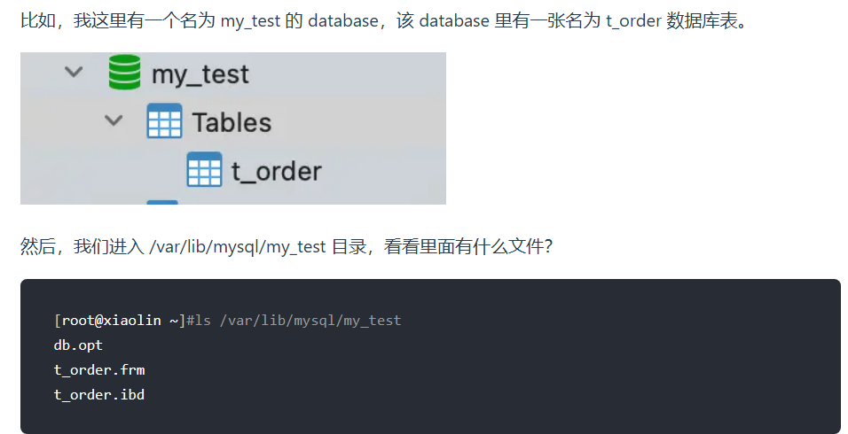

简单来说 MySQL 

**MySQL主要分为 Server 层和存储引擎层**

# Server层

Server 层负责建立连接、分析和执行 SQL

**连接器**

连接器主要和身份认证和权限相关的功能相关，就好比一个级别很高的门卫一样。

主要负责用户登录数据库，进行用户的身份认证，包括校验账户密码，权限等操作，如果用户账户密码已通过，连接器会到权限表中查询该用户的所有权限，之后在这个连接里的权限逻辑判断都是会依赖此时读取到的权限数据，也就是说，后续只要这个连接不断开，即使管理员修改了该用户的权限，该用户也是不受影响的。

**查询缓存(MySQL 8.0 版本后移除)**

查询缓存主要用来缓存我们所执行的 SELECT 语句以及该语句的结果集。

连接建立后，执行查询语句的时候，会先查询缓存，MySQL 会先校验这个 SQL 是否执行过，以 Key-Value 的形式缓存在内存中，Key 是查询语句，Value 是结果集。如果缓存 key 被命中，就会直接返回给客户端，如果没有命中，就会执行后续的操作，完成后也会把结果缓存起来，方便下一次调用。当然在真正执行缓存查询的时候还是会校验用户的权限，是否有该表的查询条件。

MySQL 查询不建议使用缓存，因为查询缓存失效在实际业务场景中可能会非常频繁，假如你对一个表更新的话，这个表上的所有的查询缓存都会被清空。对于不经常更新的数据来说，使用缓存还是可以的。

所以，一般在大多数情况下我们都是不推荐去使用查询缓存的。

MySQL 8.0 版本后删除了缓存的功能，官方也是认为该功能在实际的应用场景比较少，所以干脆直接删掉了。

**分析器**

MySQL 没有命中缓存，那么就会进入分析器，分析器主要是用来分析 SQL 语句是来干嘛的，分析器也会分为几步：

* **第一步，词法分析**，一条 SQL 语句有多个字符串组成，首先要提取关键字，比如 select，提出查询的表，提出字段名，提出查询条件等等。做完这些操作后，就会进入第二步。

* **第二步，语法分析**，主要就是判断你输入的 SQL 是否正确，是否符合 MySQL 的语法。

完成这 2 步之后，MySQL 就准备开始执行了，但是如何执行，怎么执行是最好的结果呢？这个时候就需要优化器上场了。

**优化器**

优化器的作用就是它认为的最优的执行方案去执行（有时候可能也不是最优，这篇文章涉及对这部分知识的深入讲解），比如多个索引的时候该如何选择索引，多表查询的时候如何选择关联顺序等。

可以说，经过了优化器之后可以说这个语句具体该如何执行就已经定下来。

**执行器**

当选择了执行方案后，MySQL 就准备开始执行了，首先执行前会校验该用户有没有权限，如果没有权限，就会返回错误信息，如果有权限，就会去调用引擎的接口，返回接口执行的结果。

# 存储引擎

主要负责数据的存储和读取，采用可以替换的插件式架构，支持 InnoDB、MyISAM、Memory 等多个存储引擎，其中 InnoDB 引擎有自有的日志模块 redolog 模块。**现在最常用的存储引擎是 InnoDB，它从 MySQL 5.5 版本开始就被当做默认存储引擎了。**

# MySQL的语句执行流程

[mysql执行流程，一定要看！ - 知乎 (zhihu.com)](https://zhuanlan.zhihu.com/p/362948658)

* 首先在连接器中，通过三次握手和MySQL服务建立tcp连接，然后进行身份认证，检验用户名和密码是否正确，认证通过后得到该用户的操作权限，方便后续操作，不通过就会报错

  > 补充知识：
  >
  > * 保存的用户权限，在整个连接期间，即使中途用户的权限被修改了，已经保存的权限不会改变，只有建立新的连接，才会使用新的权限
  > * `show processlis` 命令可以查看MySQL服务被多少客户端连接
  > * 空闲连接不会一直占用，MySQL中定义了最大空闲时长（默认是八小时），如果空闲时间超过了这个时间就会自动断开。除此之外，因为连接是服务端主动断开的，因此客户端并不知道，当客户端发起请求时，会给他报错，此时需要重新建立连接
  > * `show variables like 'max_connections'`可以查看MySQL服务支持的最大连接数是多少

* 查询缓存（在8.0版本之后已经被移除）

* 然后是解析SQL，在解析器中，进行词法分析和语法分析。如果有语法错误就报错

* 接着是执行SQL阶段，可以分成下面三步

  * 在预处理器中，检查 SQL 查询语句中的表或者字段是否存在，将 `select *` 中的 `*` 符号，扩展为表上的所有列；

  * 再是优化器，找到它认为最优的执行计划

    > 要想知道优化器选择了哪个索引，我们可以在查询语句最前面加个 `explain` 命令

  * 最后是执行器，它第一步先是进行权限校验，权限验证通过之后，执行器就会打开进入存储引擎，打开数据表进行数据读取，执行器也是通过存储引擎提供的API进行的操作。

[MySQL的server层和存储引擎层是如何交互的 - 知乎 (zhihu.com)](https://zhuanlan.zhihu.com/p/74045370)

>Server 层每从存储引擎读到一条记录就会发送给客户端，之所以客户端显示的时候是直接显示所有记录的，是因为客户端是等查询语句查询完成后，才会显示出所有的记录

[深入了解SQL处理流程原理（Server层与存储引擎交互、数据管理结构）-CSDN博客](https://blog.csdn.net/qq_31142237/article/details/135171314)

# MySQL 一行记录是怎么存储的？

每个数据库都有对应的一个同名目录

可以看到，共有三个文件，这三个文件分别代表着：

- db.opt，用来存储当前数据库的默认字符集和字符校验规则。
- t_order.frm ，t_order 的**表结构**会保存在这个文件。在 MySQL 中建立一张表都会生成一个.frm 文件，该文件是用来保存每个表的元数据信息的，主要包含表结构定义。
- t_order.ibd，t_order 的**表数据**会保存在这个文件。表数据既可以存在共享表空间文件（文件名：ibdata1）里，也可以存放在独占表空间文件（文件名：表名字.ibd）。这个行为是由参数 innodb_file_per_table 控制的，若设置了参数 innodb_file_per_table 为 1，则会将存储的数据、索引等信息单独存储在一个独占表空间，从 MySQL 5.6.6 版本开始，它的默认值就是 1 了，因此从这个版本之后， MySQL 中每一张表的数据都存放在一个独立的 .ibd 文件。

一张数据库表的数据是保存在「 表名字.ibd 」的文件里的，这个文件也称为独占**表空间文件**。

**表空间由段（segment）、区（extent）、页（page）、行（row）组成**

> 小林code里边：**在表中数据量大的时候，为某个索引分配空间的时候就不再按照页为单位分配了，而是按照区（extent）为单位分配。每个区的大小为 1MB，对于 16KB 的页来说，连续的 64 个页会被划为一个区，这样就使得链表中相邻的页的物理位置也相邻，就能使用顺序 I/O 了**。
>
> 那么不是连续的64个页怎么办，还没搜到，搜索的关键字是MySQL的逻辑存储结构，innodb的磁盘IO，空闲空间如何管理

[MySQL表结构，表空间，段，区，页，MVCC_苹果cms表结构详解-CSDN博客 有时间看看](https://blog.csdn.net/qq_18312025/article/details/78658171)

[(52 封私信 / 80 条消息) 关于MySQL底层的一些疑问： 1.MySQL底层数据是如何存储的 2.用了什么数据结构 3.如何组织的？ - 知乎 (zhihu.com) 特别细节，有时间看看](https://www.zhihu.com/question/26398102)

[【总结】MySQL技术内幕四：InnoDB表的逻辑存储及实现 - 知乎 (zhihu.com)](https://zhuanlan.zhihu.com/p/141338773)

>在每个段开始时，先用32个页大小的碎片页（fragment page）来存放数据，在使用完这些页之后才申请64个连续页。这样做的目的是，对于一些小表，或者是undo这类的段，可以在开始时申请较少的空间，节省磁盘容量的开销。

[14.12 InnoDB 磁盘I/O 和文件空间管理 - 知乎 (zhihu.com)](https://zhuanlan.zhihu.com/p/39992407)

>当一个段在表空间内增长时，InnoDB一次一个地分配前32个页面。 之后，InnoDB开始将整个区分配给该段。 InnoDB一次可以向一个大段添加最多4个扩展区，以确保数据的良好顺序性。

知识点：

**InnoDB 的数据是按「数据页」为单位来读写的**

InnoDB 里的 B+ 树中的**每个节点都是一个数据页**

InnoDB 数据页的默认大小是 16KB

在数据页的 File Header 中有两个指针，分别指向上一个数据页和下一个数据页，连接起来的页相当于一个双向的链表

**数据页中的记录按照「主键」顺序组成单向链表**，单向链表的特点就是插入、删除非常方便，但是检索效率不高，最差的情况下需要遍历链表上的所有节点才能完成检索。

数据页中有一个**页目录**，起到记录的索引作用

>将所有的记录划分成几个组，这些记录包括最小记录和最大记录，但不包括标记为“已删除”的记录；
>
>每个记录组的最后一条记录就是组内最大的那条记录，并且最后一条记录的头信息中会存储该组一共有多少条记录，作为 n_owned 字段（上图中粉红色字段）
>
>页目录用来存储每组最后一条记录的地址偏移量，这些地址偏移量会按照先后顺序存储起来，每组的地址偏移量也被称之为槽（slot），**每个槽相当于指针指向了不同组的最后一个记录**。

**页目录就是由多个槽组成的，槽相当于分组记录的索引**。然后，因为记录是按照「主键值」从小到大排序的，所以**我们通过槽查找记录时，可以使用二分法快速定位要查询的记录在哪个槽（哪个记录分组），定位到槽后，再遍历槽内的所有记录，找到对应的记录**，无需从最小记录开始遍历整个页中的记录链表。

# 事务

一组操作，要么都执行，要么都不执行

ACID:

原子性：事务是最小的操作单位，不可再分

一致性：事务执行前后，数据保持一致

隔离性：事务之间相互独立，不相互打扰

持久性：事务提交之后，数据库的改变是永久的

**只有保证了事务的持久性、原子性、隔离性之后，一致性才能得到保障。也就是说 A、I、D 是手段，C 是目的！**

并发事务的问题

脏读

不可重复读

幻读

MySQL事务隔离级别：

- **读未提交（*read uncommitted*）**，指一个事务还没提交时，它做的变更就能被其他事务看到；
- **读提交（*read committed*）**，指一个事务提交之后，它做的变更才能被其他事务看到；
- **可重复读（*repeatable read*）**，指一个事务执行过程中看到的数据，一直跟这个事务启动时看到的数据是一致的，**MySQL InnoDB 引擎的默认隔离级别**；
- **串行化（*serializable* ）**；会对记录加上读写锁，在多个事务对这条记录进行读写操作时，如果发生了读写冲突的时候，后访问的事务必须等前一个事务执行完成，才能继续执行；

四种隔离级别的实现：

- 对于「读未提交」隔离级别的事务来说，因为可以读到未提交事务修改的数据，所以直接读取最新的数据就好了；
- 对于「串行化」隔离级别的事务来说，通过加读写锁的方式来避免并行访问；
- 对于「读提交」和「可重复读」隔离级别的事务来说，它们是通过 **Read View 来实现的，它们的区别在于创建 Read View 的时机不同，大家可以把 Read View 理解成一个数据快照，就像相机拍照那样，定格某一时刻的风景。「读提交」隔离级别是在「每个语句执行前」都会重新生成一个 Read View，而「可重复读」隔离级别是「启动事务时」生成一个 Read View，然后整个事务期间都在用这个 Read View**。

# 日志

[必须了解的MySQL三大日志：binlog、redo log和undo log - 知乎 (zhihu.com)](https://zhuanlan.zhihu.com/p/190886874)

redo log:

[图文结合带你搞懂MySQL日志之Redo Log(重做日志) (qq.com)](https://mp.weixin.qq.com/s?__biz=MzkzMTIzMDgwMg==&mid=2247497981&idx=1&sn=689d4c3ce4f2e31ad81abc58ac68e9c5&chksm=c26c9dc0f51b14d6f90035027d98b1269a958a6557f1d5c6eec7fb4c2c8092b2111b67a0a051&scene=21#wechat_redirect)

> `WAL技术(Write-Ahead Logging)`，这种技术的思想就是先写日志，再写磁盘，只有日志写入成功，才算事务提交成功，这里的日志就是Redo Log。
>
> 当发生宕机且数据未刷到磁盘的时候，可以通过Redo Log来恢复，保证ACID中的D，这就是Redo Log的作用。

undo log:**它保证了事务的 [ACID 特性 (opens new window)](https://xiaolincoding.com/mysql/transaction/mvcc.html#事务有哪些特性)中的原子性（Atomicity）**。

[图文结合带你搞定MySQL日志之Undo log(回滚日志) (qq.com)](https://mp.weixin.qq.com/s?__biz=MzkzMTIzMDgwMg==&mid=2247496981&idx=1&sn=ec496da6e52e19ee505483a15fb54f6b&chksm=c26c9028f51b193e8d14a5e17f32d696a2cda0eb61f2fa7a3f2b3f179c9bfbd1cba09d0d83fa&scene=21#wechat_redirect)

binlog:

MySQL 在完成一条更新操作后，Server 层还会生成一条 binlog，等之后事务提交的时候，会将该事物执行过程中产生的所有 binlog 统一写 入 binlog 文件。

# 索引

[一步步带你设计MySQL索引数据结构 - 掘金 (juejin.cn)](https://juejin.cn/post/7162553989861474317#heading-7)

> Hash表速度快，但是不支持范围查询或者排序

InnoDB 引擎中，其数据文件本身就是索引文件。相比 MyISAM，索引文件和数据文件是分离的，其表数据文件本身就是按 B+Tree 组织的一个索引结构，树的叶节点 data 域保存了完整的数据记录。这个索引的 key 是数据表的主键，因此 InnoDB 表数据文件本身就是主索引。

这被称为“**聚簇索引（聚集索引）**”，而其余的索引都作为 **辅助索引**，辅助索引的 data 域存储相应记录主键的值而不是地址

在根据主索引搜索时，直接找到 key 所在的节点即可取出数据；在根据辅助索引查找时，则需要先取出主键的值，再走一遍主索引。

 因此，在设计表的时候，不建议使用过长的字段作为主键，也不建议使用非单调的字段作为主键，这样会造成主索引频繁分裂

**根据底层存储方式分类**

聚簇索引：**查询速度非常快**，**对排序查找和范围查找优化**。不足是**依赖于有序的数据**，**更新代价大**

非聚簇索引（二级索引）：**优点**：更新代价比聚簇索引要小 。非聚簇索引的更新代价就没有聚簇索引那么大了，非聚簇索引的叶子节点是不存放数据的。

**缺点**：

- **依赖于有序的数据**:跟聚簇索引一样，非聚簇索引也依赖于有序的数据
- **可能会二次查询(回表)**:这应该是非聚簇索引最大的缺点了。 当查到索引对应的指针或主键后，可能还需要根据指针或主键再到数据文件或表中查询。

- 按「数据结构」分类：**B+tree索引、Hash索引、Full-text索引**。
- 按「物理存储」分类：**聚簇索引（主键索引）、二级索引（辅助索引）**。
- 按「字段特性」分类：**主键索引、唯一索引、普通索引、前缀索引**。
- 按「字段个数」分类：**单列索引、联合索引**。

**非聚簇索引不一定回表查询。**如果查询的字段可以在二级索引找到，比如说只需要获取到对应的主键。

覆盖索引，联合索引，最左前缀匹配原则，索引下推，索引失效

## B-树和B+树

[一文彻底搞懂MySQL基础：B树和B+树的区别_mysql b树和b+树的区别-CSDN博客](https://blog.csdn.net/a519640026/article/details/106940115)

>1. B+树内节点不存储数据，所有 data 存储在叶节点导致查询时间复杂度固定为 log n。而B-树查询时间复杂度不固定，与 key 在树中的位置有关，最好为O(1)。
>
>2. B+树叶节点两两相连可大大增加区间访问性，可使用在范围查询等，而B-树每个节点 key 和 data 在一起，则无法区间查找。
>
>  > 由于B+树的叶子节点的数据都是使用链表连接起来的，而且他们在磁盘里是顺序存储的，所以当读到某个值的时候，磁盘预读原理就会提前把这些数据都读进内存，使得范围查询和排序都很快
>
>3. B+树更适合外部存储。由于内节点无 data 域，每个节点能索引的范围更大更精确
>
>  > 由于B树的节点都存了key和data，而B+树只有叶子节点存data，非叶子节点都只是索引值，没有实际的数据，这就时B+树在一次IO里面，能读出的索引值更多。从而减少查询时候需要的IO次数！

[图解：深入理解MySQL索引底层数据结构与算法-腾讯云开发者社区-腾讯云 (tencent.com)](https://cloud.tencent.com/developer/article/1691646)

> 1. 作为关系型数据库，会有很多区间查询的操作
>
> 2. I/O磁盘操作是影响计算机性能的一个瓶颈,而B+树的所有节点都会出现在叶子节点，每一行数据也挂接在叶子节点，非叶子节点仅仅充作索引目录的作用，所以每次I/O操作可以读取更多的节点数量，当找到目标数据的时候，再通过节点中的数据地址信息去读取数据，可以在总体上减少I/O操作，体检查询效率
> 3. B-最快的时候1次I/O操作就能拿到数据，而B+树每次都需要遍历到叶子节点才能拿到数据，相对来说，B+树结构的检索性能更具有稳定性

[Mysql高频面试题 -为什么 B+ 树比 B 树更适合应用于数据库索引？ - 知乎 (zhihu.com)](https://zhuanlan.zhihu.com/p/337724181#)

> 以后有时间可以看看
>
> [(52 封私信 / 80 条消息) 关于MySQL底层的一些疑问： 1.MySQL底层数据是如何存储的 2.用了什么数据结构 3.如何组织的？ - 知乎 (zhihu.com)](https://www.zhihu.com/question/26398102)	
>
> [深入理解InnoDB -- 存储篇 - 知乎 (zhihu.com)](https://zhuanlan.zhihu.com/p/161737133)

## 索引下推

[MySQL联合索引与索引下推图文详解_联合索引 索引下推-CSDN博客](https://blog.csdn.net/daidaineteasy/article/details/110246532)

索引下推能够减少**二级索引**在查询时的回表操作，提高查询的效率，因为它将 Server 层部分负责的事情，交给存储引擎层去处理了。

存储引擎定位到二级索引后，**先不执行回表**操作，而是先判断一下该索引中包含的列的条件是否成立。如果**条件不成立**，则直接**跳过该二级索引**。如果**成立**，则**执行回表**操作，将完成记录返回给 Server 层。

[你不得不知的MYSQL优化——索引下推 - 知乎 (zhihu.com)](https://zhuanlan.zhihu.com/p/582820450#:~:text=索引下推就是指在,来提高查询效率。)

>索引下推就是指在索引遍历过程中，对索引中包含的字段先做判断，直接过滤掉不满足条件的记录，减少回表次数来提高查询效率。
>
>索引下推（index condition pushdown，ICP），有效的减少了回表次数，提高了查询效率。

## 覆盖索引

在使用二级索引进行查找数据时，如果查询的数据能在二级索引找到，那么就是「索引覆盖」操作，如果查询的数据不在二级索引里，就需要先在二级索引找到主键值，需要去聚簇索引中获得数据行，这个过程就叫作「回表」。

## 最左前缀原则

[MYSQL | 最左匹配原则的原理-腾讯云开发者社区-腾讯云 (tencent.com)](https://cloud.tencent.com/developer/article/1774781)

>最左匹配原则就是指在联合索引中，如果你的 SQL 语句中用到了联合索引中的最左边的索引，那么这条 SQL 语句就可以利用这个联合索引去进行匹配

[深入理解联合索引的最左前缀原则-腾讯云开发者社区-腾讯云 (tencent.com)⭐](https://cloud.tencent.com/developer/article/2019357?areaId=106001)

>* 联合索引abc，b+树会按照先a再b再c的优先级进行排序
>
>* 遵循最左前缀原则，所以a必须要参与where条件，任意组合都可以。因为mysql有优化器可以优化顺序
>
>* 如果是ac则只会走a的索引，不会走c的索引。**但是还是走索引的**！！！！
>
>* 当只有bc或者只有b、c的时候,不会触发索引。不满足最左前缀原则

[MySQL最左匹配原则，道儿上兄弟都得知道的原则-腾讯云开发者社区-腾讯云 (tencent.com)](https://cloud.tencent.com/developer/article/1888311)

## 总结

[索引知识系列二：联合索引、索引覆盖和索引下推详解-CSDN博客](https://blog.csdn.net/mffandxx/article/details/111916252)

> 最左匹配原则：在通过联合索引检索数据时，从索引中最左边的列开始，一直向右匹配，如果遇到范围查询(>、<、between、like等)，就停止后边的匹配。
>
> 建立了联合索引后，直接在索引中就可以得到查询结果，从而不需要回表查询聚簇索引中的行数据信息。
>
> 索引下推是把本应该在 server 层进行筛选的条件，下推到存储引擎层来进行筛选判断，这样能有效减少回表。

## 索引优化

- 前缀索引优化；
- 覆盖索引优化；
- 主键索引最好是自增的；
- 防止索引失效；

## 索引失效

[深入理解联合索引的最左前缀原则-腾讯云开发者社区-腾讯云 (tencent.com)](https://cloud.tencent.com/developer/article/2019357?areaId=106001)

> - !=、<> 会索引导致失效，走全表扫描
> - or连接条件，当or左右查询字段只有一个是索引，该索引失效，只有当or左右查询字段均为索引时，才会生效
> - like 以%开头，索引无效；当like前缀没有%，后缀有%时，索引有效。
> - 组合索引，不是使用第一列索引，索引失效。
> - 数据类型出现隐式转化。如varchar不加单引号的话可能会自动转换为int型，使索引无效，产生全表扫描。
> - 在索引列上使用 IS NULL 或 IS NOT NULL操作。索引是不索引空值的，所以这样的操作不能使用索引
> - 对索引字段进行计算操作、字段上使用函数

# 锁

[超全面的MySQL语句加锁分析-CSDN博客](https://blog.csdn.net/bjweimengshu/article/details/90056126)

全局锁

表级锁：

表锁：手动加

元数据锁：自动加

意向锁：和行锁同时加，类似于自动加

行级锁：

行锁：手动+自动

*MySQL 加锁时，是先生成锁结构，然后设置锁的状态，如果锁状态是等待状态，并不是意味着事务成功获取到了锁，只有当锁状态为正常状态时，才代表事务成功获取到了锁*

# 范式

[数据库设计的三范式超详细详解_数据库三范式-CSDN博客](https://blog.csdn.net/A_art_xiang/article/details/113880638)

