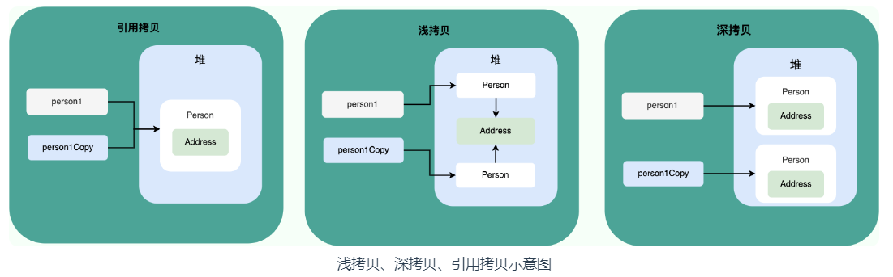

# 字节码

JVM 可以理解的代码就叫做字节码（即扩展名为 `.class` 的文件）。在一定程度上解决了传统解释性语言执行效率低的问题，而且保留了可移植性的特点。

**由于字节码并不针对某一特定的机器，所以无需重新编译，就可以在其他机器上运行**


# java程序从编写到运行的过程


我们需要格外注意的是 `.class->机器码` 这一步。在这一步 JVM 类加载器首先加载字节码文件，然后**通过解释器逐行解释执行（解释器优先发挥作用）**，这种方式的执行速度会相对比较慢。而且，有些方法和代码块是经常需要被调用的(也就是所谓的热点代码)，所以后面引进了 **JIT（Just in Time Compilation）** 编译器，而 JIT 属于运行时编译。**当 JIT 编译器完成第一次编译后，其会将热点代码的字节码对应的机器码保存下来，下次可以直接使用。**而我们知道，机器码的运行效率肯定是高于 Java 解释器的。这也解释了我们为什么经常会说 **Java 是编译与解释共存的语言** 。


> HotSpot 采用了惰性评估(Lazy Evaluation)的做法，根据二八定律，消耗大部分系统资源的只有那一小部分的代码（热点代码），**而这也就是 JIT 所需要编译的部分**。JVM 会根据代码每次被执行的情况收集信息并相应地做出一些优化，因此执行的次数越多，它的速度就越快。

## 编译与解释并存

这是因为 Java 语言既具有编译型语言的特征，也具有解释型语言的特征。因为 Java 程序要经过先编译，后解释两个步骤，由 Java 编写的程序需要先经过编译步骤，生成字节码（`.class` 文件），这种字节码必须由 Java 解释器来解释执行。


将高级语言按照执行方式分为两种

* 解释型语言：[解释型语言](https://zh.wikipedia.org/wiki/直譯語言)会通过[解释器open](https://zh.wikipedia.org/wiki/直譯器)一句一句的将代码解释（interpret）为机器代码后再执行。解释型语言开发效率比较快，执行速度比较慢。常见的解释性语言有 Python、JavaScript、PHP 等等。

* 编译型语言：[编译型语言](https://zh.wikipedia.org/wiki/編譯語言) 会通过[编译器](https://zh.wikipedia.org/wiki/編譯器)将源代码一次性翻译成可被该平台执行的机器码。一般情况下，编译语言的执行速度比较快，开发效率比较低。常见的编译性语言有 C、C++、Go、Rust 等等。

  


# java和c++

相同点：都是面向对象的语言，都支持封装多态继承

不同点：

Java 不提供指针来直接访问内存，程序内存更加安全

Java 的类是单继承的，C++ 支持多重继承；虽然 Java 的类不可以多继承，但是接口可以多继承。

Java 有自动内存管理垃圾回收机制(GC)，不需要程序员手动释放无用内存。

C ++同时支持方法重载和操作符重载，但是 Java 只支持方法重载（操作符重载增加了复杂性，这与 Java 最初的设计思想不符）

# 权限修饰符

[Java--四大权限修饰符_修饰符权限-CSDN博客](https://blog.csdn.net/I_r_o_n_M_a_n/article/details/119024516)


# 基本类型和包装类型的区别？

用途：		包装类型可用于泛型，而基本类型不可以。

存储方式：基本数据类型的局部变量存放在 Java 虚拟机栈中的局部变量表中，基本数据类型的成员变量（未被 `static` 修饰 ）存放在 Java 虚拟机的堆中。包装类型属于对象类型，我们知道几乎所有对象实例都存在于堆中。

占用空间：基础数据类型占用的空间比较小

默认值：	包装类的默认值是null，基本数据类型有对应的默认值

比较方式：对于基本数据类型，==比较的是值，包装类型比较的则是对象的地址，所有整形包装类型之间进行比较，使用equals()方法

> **为什么说是几乎所有对象实例都存在于堆中呢？** 这是因为 HotSpot 虚拟机引入了 JIT 优化之后，会对对象进行逃逸分析，如果发现某一个对象并没有逃逸到方法外部，那么就可能通过标量替换来实现栈上分配，而避免堆上分配内存。
>
> [对象实例化之后一定会存放在堆内存中？_对象实例化后一定在堆里吗?-CSDN博客](https://blog.csdn.net/Onthr/article/details/126162799)

注意：**基本数据类型存放在栈中是一个常见的误区！** 基本数据类型的存储位置取决于它们的作用域和声明方式。如果它们是局部变量，那么它们会存放在栈中；如果它们是成员变量，那么它们会存放在堆中。


# 自动拆装箱

- **装箱**：将基本类型用它们对应的引用类型包装起来；实际上是调用了包装类的valueOf方法
- **拆箱**：将包装类型转换为基本数据类型；实际上调用了包装类的xxxValue方法

例如：

- `Integer i = 10` 等价于 `Integer i = Integer.valueOf(10)`
- `int n = i` 等价于 `int n = i.intValue()`;
- 可以用javap查看他们对应的字节码文件

拆装箱会影响性能，尽量避免不必要的操作。

面试：是指基本数据类型和包装类之间可以自动地相互转换，


# 浮点数精度和整数数据溢出问题：

对于浮点数精度问题。产生的原因是用二进制存储小数时，经常会出现无限循环的小数，比如十进制的小数0.2，换成二进制存储时，就会是0.00110011......但是计算机一个浮点数的长度是有限制的，只能进行截断处理，因此会有浮点数精度损失的问题，浮点数无法用二进制精确的表示。

解决方案就是使用BigDecimal。使用时要注意，在创建BigDecimal时，要用`BigDecimal(String val)`这种传入字符串的构造方法；或者直接用valueOf方法传入double类型的数据，因为valueOf内部自动调用了将double转为字符串的方法，Double.toString()。所以这两个方法的共同点，都是通过字符串来直接构造对象。


当数据要超过long整形的表示范围，可以通过BigInteger存储数据，内部是通过int[]数组来存储数据。


# 成员变量&局部变量&静态变量

**语法形式**：从语法形式上看，成员变量是属于类的，而局部变量是在代码块或方法中定义的变量或是方法的参数；成员变量可以被 `public`,`private`,`static` 等修饰符所修饰，而局部变量不能被访问控制修饰符及 `static` 所修饰；但是，成员变量和局部变量都能被 `final` 所修饰。

**存储方式**：从变量在内存中的存储方式来看，如果成员变量是使用 `static` 修饰的，那么这个成员变量是属于类的，如果没有使用 `static` 修饰，这个成员变量是属于实例的。而对象存在于堆内存，局部变量则存在于栈内存。

**生存时间**：从变量在内存中的生存时间上看，成员变量是对象的一部分，它随着对象的创建而存在，而局部变量随着方法的调用而自动生成，随着方法的调用结束而消亡。

**默认值**：从变量是否有默认值来看，成员变量如果没有被赋初始值，则会自动以类型的默认值而赋值（一种情况例外:被 `final` 修饰的成员变量也必须显式地赋值），而局部变量则不会自动赋值。

> 通常情况下，静态变量会被 `final` 关键字修饰成为常量。


## 静态方法为什么不能调用非静态成员?

这个需要结合 JVM 的相关知识，主要原因如下：

1. 静态方法是属于类的，在类加载的时候就会分配内存，可以通过类名直接访问。而非静态成员属于实例对象，只有在对象实例化之后才存在，需要通过类的实例对象去访问。
2. 在类的非静态成员不存在的时候静态方法就已经存在了，此时调用在内存中还不存在的非静态成员，属于非法操作。

## 重写

重写发生在运行期，是子类对父类的允许访问的方法的实现过程进行重新编写。

1. 方法名、参数列表必须相同，子类方法返回值类型应比父类方法返回值类型更小或相等，抛出的异常范围小于等于父类，访问修饰符范围大于等于父类。
2. 如果父类方法访问修饰符为 `private/final/static` 则子类就不能重写该方法，但是被 `static` 修饰的方法能够被再次声明。
3. 构造方法无法被重写

> 可以返回类型更小的意思是：可以返回子类


# 面向对象

## 面向对象和面向过程的区别

两者的主要区别在于解决问题的方式不同：

- 面向过程把解决问题的过程拆成一个个方法，通过一个个方法的执行解决问题。
- 面向对象会先抽象出对象，然后用对象执行方法的方式解决问题。

另外，面向对象开发的程序一般更易维护、易复用、易扩展。

>面向过程 ：面向过程性能比面向对象高。 因为类调用时需要实例化，开销比较大，比较消耗资源，所以当性能是最重要的考量因素的时候，比如单片机、嵌入式开发、Linux/Unix等一般采用面向过程开发。
>
>----》》
>这个并不是根本原因，面向过程也需要分配内存，计算内存偏移量，Java性能差的主要原因并不是因为它是面向对象语言，而是Java是半编译语言，最终的执行代码并不是可以直接被CPU执行的二进制机械码。
>
>而面向过程语言大多都是直接编译成机械码在电脑上执行，并且其它一些面向过程的脚本语言性能也并不一定比Java好。


构造方法不能被 override（重写）,但是可以 overload（重载）,所以你可以看到一个类中有多个构造函数的情况。


# 三大特征

- 封装：封装是指把一个对象的状态信息（也就是属性）隐藏在对象内部，不允许外部对象直接访问对象的内部信息。但是可以提供一些可以被外界访问的方法来操作属性。

- 继承：不同类型的对象，相互之间经常有一定数量的共同点，但是也会有不同点，继承就是使用已存在的类作为基础建立新类。新类可以在此基础上，增加新的数据或者方法，也可以使用父类的方法。

  - 子类拥有父类对象所有的属性和方法（包括私有属性和私有方法），但是父类中的私有属性和方法子类是无法访问，**只是拥有**。

  * 子类可以拥有自己属性和方法，即子类可以对父类进行扩展。

  * 子类可以用自己的方式实现父类的方法。

  * 子类中所有的构造器默认都会先访问父类中无参的构造器，再执行自己。

    * 子类在初始化的时候，有可能会使用到父类中的数据，如果父类没有完成初始化，子类将无法使用父类的数据。

    * 子类初始化之前，一定要调用父类构造器先完成父类数据空间的初始化。
    * 子类构造器的第一行语句默认都是：super()，不写也存在。因此父类中必须有无参构造器，不然会报错

* 多态：同一行为，通过不同的子类，可以体现出来的不同的形态。


# 接口&抽象类&重写

* 类和类的关系：单继承。

* 类和接口的关系：多实现。

* 接口和接口的关系：多继承，一个接口可以同时继承多个接口。（规范合并，整合多个接口为同一个接口，便于子类实现）


> **方法重写注意事项和要求**
>
> * 重写方法的名称、形参列表必须与被重写方法的名称和参数列表一致。
> * 私有方法不能被重写。
> * 子类重写父类方法时，访问权限必须大于或者等于父类 （暂时了解 ：缺省 < protected < public）
> * 子类不能重写父类的静态方法，如果重写会报错的。static


接口和抽象类的共同点和区别

**共同点**：

- 都不能被实例化。
- 都可以包含抽象方法。
- 都可以有默认实现的方法（Java 8 可以用 `default` 关键字在接口中定义默认方法）。

**区别**：

- 接口主要用于对类的行为进行约束，你实现了某个接口就具有了对应的行为。抽象类主要用于代码复用，强调的是所属关系。
- 一个类只能继承一个类，但是可以实现多个接口。
- 接口中的成员变量只能是 `public static final` 类型的，不能被修改且必须有初始值，而抽象类的成员变量默认 default，可在子类中被重新定义，也可被重新赋值。


补充知识：default

> [Java 中的 Default 关键字 - 知乎 (zhihu.com)](https://zhuanlan.zhihu.com/p/662667309)
>
> Default 方法通常用在接口中，**用于为接口中定义的方法提供一个默认的实现**。实际上也是接口的一个方法而已，只不过有个默认实现
>
> 当我们使用了 default 关键字修饰了方法后，我们可以不为接口定义实现，而直接使用接口中定义的默认方法来处理逻辑。


> final和abstract是什么关系？互斥关系
>
> abstract定义的抽象类作为模板让子类继承，final定义的类不能被继承。
>
> 抽象方法定义通用功能让子类重写，final定义的方法子类不能重写。
>
> 同理abstract和static也是互斥关系


# 深浅拷贝

和c++中的大同小异。

补充知识Cloneable

[Java中Cloneable的使用 - 简书 (jianshu.com)](https://www.jianshu.com/p/ea8f7b1fbbb1)

> Cloneable是标记型的接口，**它们内部都没有方法和属性**，实现 Cloneable来表示该对象能被克隆，能使用Object.clone()方法。如果没有实现 Cloneable的类对象调用clone()就会抛出CloneNotSupportedException。

要让对象可以被克隆，应具备以下2个条件：

- 让该类实现java.lang.Cloneable接口；
- 重写（Override）Object的clone()方法；

[Cloneable接口的作用与深入理解深度克隆与浅度克隆-CSDN博客](https://blog.csdn.net/qq_37113604/article/details/81168224)

> 这里主要不是关于Cloneable的补充知识，是和native有关的，因为这篇文章提到了native
>
> native修饰的方法都是空的方法，但是这些方法都是有实现体的（这里也就间接说明了native关键字不能与abstract同时使用。因为abstract修饰的方法与java的接口中的方法类似，他显式的说明了修饰的方法，在当前是没有实现体的，abstract的方法的实现体都由子类重写），只不过native方法调用的实现体，都是非java代码编写的（例如：调用的是在jvm中编写的C的接口），每一个native方法在jvm中都有一个同名的实现体，native方法在逻辑上的判断都是由实现体实现的，另外这种native修饰的方法对返回类型，异常控制等都没有约束。 
>

**浅拷贝**：浅拷贝会在堆上创建一个新的对象（区别于引用拷贝的一点），不过，如果原对象内部的属性是引用类型的话，浅拷贝会直接复制内部对象的引用地址，也就是说拷贝对象和原对象共用同一个内部对象。也就是说其实也创建了一个对象，但是这个对象里边的引用类型的成员变量只是复制了一个地址而已。

**深拷贝**：深拷贝会完全复制整个对象，包括这个对象所包含的内部对象

**引用拷贝**： 简单来说，引用拷贝就是两个不同的引用指向同一个对象。



图二中就可以看出其实是创建了本体的一个对象的，只是里边的成员变量用的是同一个


# Object&String

Object常用方法：

```java
/**
 * native 方法，用于返回当前运行时对象的 Class 对象，使用了 final 关键字修饰，故不允许子类重写。
 */
public final native Class<?> getClass()
/**
 * native 方法，用于返回对象的哈希码，主要使用在哈希表中，比如 JDK 中的HashMap。
 */
public native int hashCode()
/**
 * 用于比较 2 个对象的内存地址是否相等，String 类对该方法进行了重写以用于比较字符串的值是否相等。
 */
public boolean equals(Object obj)
/**
 * native 方法，用于创建并返回当前对象的一份拷贝。
 */
protected native Object clone() throws CloneNotSupportedException
/**
 * 返回类的名字实例的哈希码的 16 进制的字符串。建议 Object 所有的子类都重写这个方法。
 */
public String toString()
/**
 * native 方法，并且不能重写。唤醒一个在此对象监视器上等待的线程(监视器相当于就是锁的概念)。如果有多个线程在等待只会任意唤醒一个。
 */
public final native void notify()
/**
 * native 方法，并且不能重写。跟 notify 一样，唯一的区别就是会唤醒在此对象监视器上等待的所有线程，而不是一个线程。
 */
public final native void notifyAll()
/**
 * native方法，并且不能重写。暂停线程的执行。注意：sleep 方法没有释放锁，而 wait 方法释放了锁 ，timeout 是等待时间。
 */
public final native void wait(long timeout) throws InterruptedException
/**
 * 多了 nanos 参数，这个参数表示额外时间（以纳秒为单位，范围是 0-999999）。 所以超时的时间还需要加上 nanos 纳秒。。
 */
public final void wait(long timeout, int nanos) throws InterruptedException
/**
 * 跟之前的2个wait方法一样，只不过该方法一直等待，没有超时时间这个概念
 */
public final void wait() throws InterruptedException
/**
 * 实例被垃圾回收器回收的时候触发的操作
 */
protected void finalize() throws Throwable { }

```


## intern在1.6，1.7和1.8的区别：

[图解JDK 1.6、1.7中String.intern()的区别_java 中 intern jdk1.7 和 1.6-CSDN博客（注意看里边的问题）](https://blog.csdn.net/mkfka/article/details/108047023)

[JVM-intern方法在1.6和1.8版本实现区别-腾讯云开发者社区-腾讯云 (tencent.com)](https://cloud.tencent.com/developer/article/2358485)

[字符串常量池和String.intern()方法在jdk1.6、1.7、1.8中的变化 - 提拉没有米苏 - 博客园 (cnblogs.com)](https://www.cnblogs.com/cherish010/p/10266729.html)

[字符串intern()方法详解-CSDN博客](https://blog.csdn.net/zs357/article/details/121908596)

>字符串常量池
>
>jdk1.6中，它是在方法区中，属于“永久代”
>
>jdk1.7中，它被移除方法区，放在java堆中
>

>jdk1.6，是将字符串对象复制一份然后放入串池，jdk1.7以后的版本是将字符串对象的引用放入串池中

> 重要知识点就是串池的位置变化，和intern方法的作用
>
> 如果字符串加法中全是字面量相加，则在前端编译为.class字节码文件时，会被直接优化为加和。注意这里一定是字面量相加才会优化，如果是这样的 String a="hello";  String b=a+"world"; 这样是不会优化的。因为a不是字面量，就是一个常量。


## String&StringBuffer&StringBuilder

可变性：

String是不可变的

> ```java
> public final class String implements java.io.Serializable,Comparable<String>, CharSequence {
>     // @Stable 注解表示变量最多被修改一次，称为“稳定的”。
>     @Stable
>     private final byte[] value;
> }
> ```
>
> String不可变的原因和final修饰数组没关系，因为它修饰的是引用类型的变量。真正的原因是保存字符串的数组被 `final` 修饰且为私有的，并且`String` 类没有提供/暴露修改这个字符串的方法。
>
> `String` 类被 `final` 修饰导致其不能被继承，进而避免了子类破坏 `String` 不可变。

StringBuilder 与 StringBuffer是可变的

> ```java
> abstract class AbstractStringBuilder implements Appendable, CharSequence {
>     byte[] value;
> }
> ```
>
> StringBuilder 与 StringBuffer 都继承自 `AbstractStringBuilder` 类，在 `AbstractStringBuilder` 中也是使用字符数组保存字符串，不过没有使用 `final` 和 `private` 关键字修饰，最关键的是这个 `AbstractStringBuilder` 类还提供了很多修改字符串的方法比如 `append` 方法

线程安全：

`String` 中的对象是不可变的，也就可以理解为常量，线程安全。

> `AbstractStringBuilder` 是 `StringBuilder` 与 `StringBuffer` 的公共父类，定义了一些字符串的基本操作，如 `expandCapacity`、`append`、`insert`、`indexOf` 等公共方法。

`StringBuffer` 对方法加了同步锁或者对调用的方法加了同步锁，所以是线程安全的。

`StringBuilder` 并没有对方法进行加同步锁，所以是非线程安全的。

性能

每次对 `String` 类型进行改变的时候，都会生成一个新的 `String` 对象，然后将指针指向新的 `String` 对象。`StringBuffer` 每次都会对 `StringBuffer` 对象本身进行操作，而不是生成新的对象并改变对象引用。相同情况下使用 `StringBuilder` 相比使用 `StringBuffer` 仅能获得 10%~15% 左右的性能提升，但却要冒多线程不安全的风险。


## 字符串拼接用哪个？

String的 + 法运算实际上是通过 `StringBuilder` 调用 `append()` 方法实现的，拼接完成之后调用 `toString()` 得到一个 `String` 对象 。

注意jdk9之前每一个 + 运算都要创建一个StringBuilder对象，所以尽量还是用StringBuilder进行字符串拼接。jdk9之后解决了这个问题。用哪个都无所谓


## Java 9 为何要将 `String` 的底层实现由 `char[]` 改成了 `byte[]`

从上面可以看到，无论是String还是StringBuffer和StringBuilder底层都是byte数组

[Java 9 为何要将String的底层实现由char[\]改成了byte[]?-腾讯云开发者社区-腾讯云 (tencent.com)](https://cloud.tencent.com/developer/article/1984858)

[jdk9为何要将String的底层实现由char[\]改成了byte[]_jdk9为什么将string底层改为byte-CSDN博客](https://blog.csdn.net/tc979907461/article/details/117435188)

最主要的目的是**为了节省字符串占用的内存** 。内存占用减少带来的另外一个好处，就是 GC 次数也会减少。

> 优化空间的好处：单位时间内，减少空间->减少触发GC的次数->减少Stop the world activity的次数->提高系统性能


实际开发中，单字节的字符使用频率仍然要高于双字节的，使用char[]来表示String就导致了即使String中的字符单个字节就能表示，还是得占用了两个字节，而实际开发中使用频率最高的却是单字节的字符。

所以可以选择用占一位字节的Byte数组，而不是两个字节的char数组。仅仅将 `char[]` 优化为 `byte[]` 是不够的，**还要配合 Latin-1 的编码方式**，该编码方式是用单个字节来表示字符的，这样就比 UTF-8 编码节省了更多的空间。

此外，String类中多了一个编码标志位coder，用来表示使用的是utf-16编码，还是Latin-1编码。java会根据字符串的内容自动设置相应的编码，要么UTF16，要么LATIN1。

## 问题：字符串常量池中全存储的是对象引用吗？

[从字符串到常量池，一文看懂String类设计 - 知乎 (zhihu.com)](https://zhuanlan.zhihu.com/p/149055800)

[第 13 章 StringTable详解 - 知乎 (zhihu.com)（可以看一下，但其实对这个问题没什么用）](https://zhuanlan.zhihu.com/p/265264819)

[Java基础：带你深入了解StringTable（含Java面试资料） - 知乎 (zhihu.com)（乱七八糟一堆，没怎么看下去）](https://zhuanlan.zhihu.com/p/110307661)


**字符串常量池** 是 JVM 为了提升性能和减少内存消耗针对字符串（String 类）专门开辟的一块区域，主要目的是为了避免字符串的重复创建


# 异常

Exception：程序本身可以处理的**异常**

Error：程序无法处理的**错误**

但是都可以被捕获


**Checked Exception 和 Unchecked Exception**

* **Checked Exception** 即 受检查异常 ，Java 代码在编译过程中，如果受检查异常没有被 `catch`或者`throws` 关键字处理的话，就没办法通过编译。

* **Unchecked Exception** 即 **不受检查异常** ，Java 代码在编译过程中 ，我们即使不处理不受检查异常也可以正常通过编译。


**try-catch-finally**

**注意：不要在 finally 语句块中使用 return!** 当 try 语句和 finally 语句中都有 return 语句时，try 语句块中的 return 语句会被忽略。这是因为 try 语句中的 return 返回值会先被暂存在一个本地变量中，当执行到 finally 语句中的 return 之后，这个本地变量的值就变为了 finally 语句中的 return 返回值。

```java
public static void main(String[] args) {
    System.out.println(f(2));
}

public static int f(int value) {
    try {
        return value * value;
    } finally {
        if (value == 2) {
            return 0;
        }
    }
}
//输出为0
```

[Java中try-with-resources的使用_try with resources用法-CSDN博客](https://blog.csdn.net/liuqinhou/article/details/127950993)


# 泛型

```java
public class Father<T,E> implements Son<E>{
    static<T> void hello(T a){
        System.out.println(a);
    }
    @Override
    public E mothod() {
        return null;
    }
}
interface Son<T>{
    T mothod();
}
```

父类在实现子类的泛型接口时，子类的泛型必须是父类中提供的泛型。Father<T,E>，那么子类就只能写Son\<T>或者Son\<E>。

注意: `static < E > void hello( T a )` 一般被称为静态泛型方法;在 java 中泛型只是一个占位符，必须在传递类型后才能使用。**类在实例化时才能真正的传递类型参数**，由于静态方法的加载先于类的实例化，也就是说**类中的泛型还没有传递真正的类型参数，静态的方法的加载就已经完成了**，所以静态泛型方法是没有办法使用类上声明的泛型的。只能使用自己声明的 `<E>`

**泛型也是个语法糖**


# 反射&注解

[java菜鸟到大佬——全网最全反射机制讲解 - 掘金 (juejin.cn)](https://juejin.cn/post/7155660628953137159?from=search-suggest#heading-3)

[Java注解入门到精通，这一篇就够了-CSDN博客](https://blog.csdn.net/KingBoyWorld/article/details/105337011)

[Java反射（超详细！）-CSDN博客](https://blog.csdn.net/qq_44715943/article/details/120587716)

如果说大家研究过框架的底层原理或者咱们自己写过框架的话，一定对反射这个概念不陌生。反射之所以被称为框架的灵魂，主要是因为它赋予了我们在运行时分析类以及执行类中方法的能力。通过反射你可以获取任意一个类的所有属性和方法，你还可以调用这些方法和属性。


# 动态代理

**我们使用代理对象来代替对真实对象(real object)的访问，这样就可以在不修改原目标对象的前提下，提供额外的功能操作，扩展目标对象的功能。**

**代理模式的主要作用是扩展目标对象的功能，比如说在目标对象的某个方法执行前后你可以增加一些自定义的操作。**

## 静态代理

**静态代理中，我们对目标对象的每个方法的增强都是手动完成的（\*后面会具体演示代码\*），非常不灵活（\*比如接口一旦新增加方法，目标对象和代理对象都要进行修改\*）且麻烦(\*需要对每个目标类都单独写一个代理类\*）。** 实际应用场景非常非常少，日常开发几乎看不到使用静态代理的场景。

上面我们是从实现和应用角度来说的静态代理，从 JVM 层面来说， **静态代理在编译时就将接口、实现类、代理类这些都变成了一个个实际的 class 文件。**

静态代理实现步骤:

1. 定义一个接口及其实现类；
2. 创建一个代理类同样实现这个接口
3. 将目标对象注入进代理类，然后在代理类的对应方法调用目标类中的对应方法。这样的话，我们就可以通过代理类屏蔽对目标对象的访问，并且可以在目标方法执行前后做一些自己想做的事情。

## 动态代理

**从 JVM 角度来说，动态代理是在运行时动态生成类字节码，并加载到 JVM 中的。动态代理的代理关系是在运行时期确定的**

* **JDK动态代理**：**需要被代理对象的类实现了某些接口**，生成的代理类也会实现相应的接口

* **CGLIB动态代理**：不需要被代理对象的类实现了某些接口，**生成的代理类为目标对象的类的子类**

搜索关键词：jdk代理

[经典面试题-聊聊JDK和CGLib动态代理实现和区别_面试谈谈你对jdk 动态代理和 cglib 动态代理的理解-CSDN博客](https://blog.csdn.net/jason_wang1989/article/details/115272872)

[你必须会的 JDK 动态代理和 CGLIB 动态代理 - 知乎 (zhihu.com)](https://zhuanlan.zhihu.com/p/126503023)

[动态代理——JDK动态代理原理&示例解析（图文并茂）_jdk动态代理复杂示例-CSDN博客](https://blog.csdn.net/qq_22772259/article/details/112508953)

# SPI&API

[Java SPI 和 API，傻傻分不清？-阿里云开发者社区 (aliyun.com)](https://developer.aliyun.com/article/911488)

> 从「面向接口编程」的思想来看，「调用方」应该通过调用「接口」而不是「具体实现」来处理逻辑。那么，对于「接口」的定义，应该在「调用方」还是「实现方」呢？
>
> 理论上来说，会有三种选择：
>
> - 「接口」定义在「实现方」
> - 「接口」定义在「调用方」
> - 「接口」定义在 独立的包中
>
> 先来看看「接口」属于「实现方」的情况。这个很容易理解，实现方同时提供了「接口」和「实现类」，「调用方」可以引用接口来达到调用某实现类的功能，这就是我们日常使用的API。**API的最显著特征就是**：
>
> > 实现和接口在一个包中。自定义接口，自实现类。
>
> 
>
> 再来看看「接口」属于「调用方」的情况。这个其实就是SPI机制。以JDBC驱动为例，「调用方」（用户或者说JDK)定义了`java.sql.Driver`接口，这个接口位于「调用方」JDK的包中，各个数据库厂商实现了这个接口，比如mysql驱动`com.mysql.jdbc.Driver`。因此，**SPI最显著的特征就是**：
>
> > 「接口」在「调用方」的包，「调用方」定义规则，而自定义实现类在「实现方」的包，然后把实现类加载到「调用方」中。
>
> 
>
> 最后一种情况，如果一个「接口」在一个上下文是API，在另一个上下文是SPI，那么就可以把「接口」定义在独立的包中。


# 序列化

[java序列化，看这篇就够了 - 9龙 - 博客园 (cnblogs.com)](https://www.cnblogs.com/9dragon/p/10901448.html)

[序列化和反序列化的详解-CSDN博客](https://blog.csdn.net/tree_ifconfig/article/details/82766587)

[序列化理解起来很简单 - 知乎 (zhihu.com)（看里边的问题）](https://zhuanlan.zhihu.com/p/40462507)

如果我们需要持久化 Java 对象比如将 Java 对象保存在文件中，或者在网络传输 Java 对象，这些场景都需要用到序列化。

序列化和反序列化的定义：

* Java序列化就是指把Java对象转换为字节序列的过程
* Java反序列化就是指把字节序列恢复为Java对象的过程。

* 序列化最重要的作用：在传递和保存对象时.保证对象的完整性和可传递性。对象转换为有序字节流,以便在网络上传输或者保存在本地文件中。 
* 反序列化的最重要的作用：根据字节流中保存的对象状态及描述信息，通过反序列化重建对象。

总结：核心作用就是对象状态的保存和重建。（整个过程核心点就是字节流中所保存的对象状态及描述信息）


# I/O


# 语法糖

**语法糖（Syntactic sugar）** 代指的是编程语言为了方便程序员开发程序而设计的一种特殊语法，这种语法对编程语言的功能并没有影响。实现相同的功能，基于语法糖写出来的代码往往更简单简洁且更易阅读。

不过，JVM 其实并不能识别语法糖，Java 语法糖要想被正确执行，需要先通过编译器进行解糖，也就是在程序编译阶段将其转换成 JVM 认识的基本语法


# 值传递

程序设计语言将实参传递给方法（或函数）的方式分为两种：

- **值传递**：方法接收的是实参值的拷贝，会创建副本。
- **引用传递**：方法接收的直接是实参所引用的对象在堆中的地址，不会创建副本，对形参的修改将影响到实参。

很多程序设计语言（比如 C++、 Pascal )提供了两种参数传递的方式，不过，在 Java 中只有值传递。

想要理解java中只有值传递，需要搞清楚引用传递和指针传递的区别。这里通过C++来讲解，因为java中不存在这两种传递方式。看下面的文章。指针传递传的也是值，只不过这个值是地址而已。

[C++笔记——参数传递中的指针传递和引用传递 - 知乎 (zhihu.com)](https://zhuanlan.zhihu.com/p/130464385)

> **指针传递的实质：**指针传递参数本质上是值传递的方式，它所传递的是一个地址值。值传递过程中，被调函数的形式参数作为被调函数的局部变量处理


# unsafe

[浅析 Unsafe 的使用 - java框架工具解析 - SegmentFault 思否](https://segmentfault.com/a/1190000018037554)

[Unsafe API介绍及其使用 - 大雨如注 - 博客园 (cnblogs.com)](https://www.cnblogs.com/loveyoumi/p/9467078.html)

---

---

realloc函数的各种情况分析：

当使用`realloc()`函数进行内存重分配时，可能会出现以下几种情况：

1. 新内存块大小与旧内存块大小相同：如果新内存块大小与旧内存块大小相同，并且系统可以在现有地址上进行调整，`realloc()`函数可能会在原地调整内存块的大小，而不会分配新的内存块。在这种情况下，返回的指针将与旧地址相同。
2. 新内存块大小小于旧内存块大小：如果新内存块大小小于旧内存块大小，且系统可以在现有地址上进行调整，`realloc()`函数可能会在原地调整内存块的大小，而不分配新的内存块。在这种情况下，返回的指针将与旧地址相同。
3. 新内存块大小大于旧内存块大小且有足够的空闲内存：如果新内存块大小大于旧内存块大小，并且系统有足够的连续空闲内存可供分配，`realloc()`函数将分配一个新的内存块，并将旧内存块中的数据复制到新的内存块中。然后，`realloc()`函数将释放旧的内存块并返回新的内存块地址。新地址将与旧地址不同。
4. 新内存块大小大于旧内存块大小但没有足够的空闲内存：如果新内存块大小大于旧内存块大小，但系统没有足够的连续空闲内存可供分配，`realloc()`函数将尝试在其他地方重新分配内存块。它可能会分配一个新的内存块，并将旧内存块中的数据复制到新的内存块中。然后，`realloc()`函数将释放旧的内存块并返回新的内存块地址。新地址将与旧地址不同。

需要注意的是，特定的系统和实现可能会有所不同，并且可能存在其他情况。此外，如果`realloc()`函数调用失败，它可能会返回`NULL`指针，表示内存分配失败或出现错误。

在使用`realloc()`函数时，应该小心处理返回的指针，并确保正确处理内存块的大小和数据复制，以避免数据丢失、内存泄漏或访问错误。


Unsafe.reallocateMemory函数的各种情况分析：

对于Java中的`Unsafe.reallocateMemory()`方法，它是`Unsafe`类提供的一种方法，用于重新分配已经分配的内存块的大小。由于`Unsafe`类的操作是底层、直接的内存操作，使用它需要非常小心并且了解其行为和风险。

在使用`Unsafe.reallocateMemory()`方法进行内存重分配时，以下情况可能发生：

1. 新内存块大小与旧内存块大小相同：由于`Unsafe.reallocateMemory()`方法是底层方法，它不会在原地调整内存块的大小。因此，即使新的内存块大小与旧的内存块大小相同，也会分配一个新的内存块，并将旧内存块中的数据复制到新的内存块中。返回的指针将指向新的内存块地址。
2. 新内存块大小小于旧内存块大小：与情况1类似，`Unsafe.reallocateMemory()`方法不会在原地调整内存块的大小，而是分配一个新的内存块，并将旧内存块中的数据复制到新的内存块中。返回的指针将指向新的内存块地址。
3. 新内存块大小大于旧内存块大小：如果新内存块大小大于旧内存块大小，`Unsafe.reallocateMemory()`方法将分配一个新的内存块，并将旧内存块中的数据复制到新的内存块中。然后，它将返回指向新的内存块地址的指针。新地址将与旧地址不同。

需要注意的是，`Unsafe.reallocateMemory()`方法是非常底层的方法，直接操作内存，并且不提供自动内存管理或垃圾回收。因此，在使用该方法时，需要确保正确处理内存块的大小和数据复制，以避免数据丢失、内存泄漏或访问错误。此外，使用`Unsafe`类需要谨慎操作，并且需要了解Java内存模型和相关的安全风险。

---

---

内存操作：

unsafe使用堆外内存，DirectByteBuffer是其一个重要的应用，作为缓存池

问题：unsafe的reallocateMemory和c语言中的realloc有点不同：

在C语言中，`realloc()` 函数用于重新分配之前分配的内存空间大小。如果调用成功，原内存空间会被释放，并且返回一个指向新分配内存空间的指针。这意味着在使用 `realloc()` 后不需要手动释放原内存空间。

然而，在Java中，`Unsafe.reallocateMemory()` 方法的行为与C语言中的 `realloc()` 函数略有不同。它确实会尝试重新分配内存空间，并返回一个指向新分配内存空间的地址，但它不会自动释放原内存空间。因此，您需要手动释放原内存空间，通常是通过调用 `Unsafe.freeMemory()` 方法或其他适当的手动内存管理方法来实现。

因此，在使用 `Unsafe.reallocateMemory()` 方法时，确保手动释放原内存空间是很重要的，以避免内存泄漏和资源浪费。


