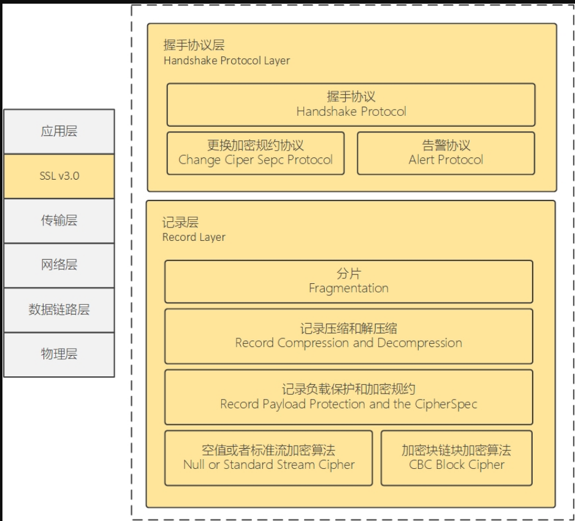

# OSI七层模型和TCP/IP四层模型

[一文彻底搞懂OSI七层模型和TCP/IP四层模型_osi网络协议-CSDN博客](https://blog.csdn.net/weixin_44772566/article/details/136717134)

- 应用层：这是网络体系结构中的最顶层，提供用户接口和应用程序之间的通信服务。在这一层，用户可以访问各种网络应用程序，如电子邮件、文件传输和远程登录。
- 表示层：该层负责数据的格式化、加密和压缩，以确保数据在不同系统之间的交换是有效的和安全的。它还提供了数据格式转换和语法转换的功能。\
- 会话层：会话层管理应用程序之间的通信会话，负责建立、维护和终止会话。它还提供了数据的同步和检查点恢复功能，以确保通信的完整性和持续性。
- 传输层：传输层为应用程序提供端到端的数据传输服务，负责数据的分段、传输控制、错误恢复和流量控制。它主要使用 TCP（传输控制协议）和 UDP（用户数据报协议）来实现这些功能。
- 网络层：网络层负责数据包的路由和转发，以及网络中的寻址和拥塞控制。它选择最佳的路径来传输数据包，以确保它们能够从源主机到目标主机进行传输。
- 数据链路层：数据链路层提供点对点的数据传输服务，负责将原始比特流转换为数据帧，并检测和纠正传输中出现的错误。它还控制访问物理媒介的方式，以及数据帧的传输和接收。
- 物理层：主要作用是在物理媒介上传输原始比特流，定义了连接主机的硬件设备和传输媒介的规范。

**TCP是面向连接的**

# http

**HTTP 是一个在计算机世界里专门在「两点」之间「传输」文字、图片、音频、视频等「超文本」数据的「约定和规范」。**

## 缓存技术

强制缓存和协商缓存

[图解Http缓存控制之max-age=0、no-cache、no-store区别 - 知乎 (zhihu.com)](https://zhuanlan.zhihu.com/p/55623075)

[HTTP缓存之协商缓存和强制缓存 - 知乎 (zhihu.com)](https://zhuanlan.zhihu.com/p/143064070)

> 通常根据是否需要向服务器重新发起HTTP请求去确认缓存是否有效将缓存分为强制缓存和协商缓存
>
> `强制缓存`优先于`协商缓存`，若强制缓存生效则直接使用缓存，若不生效则进行协商缓存，协商缓存由服务器决定是否使用缓存，若协商缓存失效，那么代表该请求的缓存失效，重新获取请求结果，再存入浏览器缓存中；生效则返回304，继续使用缓存。

[一文彻底掌握HTTP缓存 - 知乎 (zhihu.com)](https://zhuanlan.zhihu.com/p/342774826)

>优先级最高的是强缓存，在命中强缓存失败的情况下，才会走协商缓存

[HTTP缓存的三种方式详解 - 掘金 (juejin.cn)](https://juejin.cn/post/7063861101041025031)

>

总结一下，强制缓存和协商缓存并不是独立的，而是相互合作完成http请求和响应，当本地缓存没有过期失效，那么就是强缓存，不需要向服务器发送请求询问缓存是否还有效，当缓存过期就需要协商缓存去询问服务器，获取结果。

缓存用到的字段：

http1.0：`Expires`和`If-Modified-Since` , `Last-Modified` 字段

http1.1：`Cache-Control`和`If-None-Match` ，`ETag`字段

[【前端 · 面试 】HTTP 总结（九）—— HTTP 协商缓存 - 知乎 (zhihu.com)](https://zhuanlan.zhihu.com/p/398436341)

>* 协商缓存是依靠缓存标识来判断资源是否有效。
>
>* 缓存标识包括 Last-Modified（If-Modified-Since）和 Etag（If-None-Match）。
>
>* 响应头携带的是 Last-Modified 和 Etag。
>* 请求头携带的是 If-Modified-Since 和 If-None-Match。
>* Etag 是 Last-Modified 的补充和完善，并不能完全替代 Last-Modified。
>* Etag 的优先级高于 Last-Modified。
>* Last-Modified 的性能要高于 Etag，但是精确性却逊色于 Etag。

[10分钟彻底搞懂Http的强制缓存和协商缓存 - SegmentFault 思否](https://segmentfault.com/a/1190000016199807)

> 在 `http 1.0` 版本中，强制缓存通过 `Expires` 响应头来实现。
>
> 在 `http 1.1` 版本中，强制缓存通过 `Cache-Control` 响应头来实现。
>
> 在 `http 1.0` 版本中，第一次请求资源时服务器通过 `Last-Modified` 来设置响应头的缓存标识
>
> 在 `http 1.1` 版本中，服务器通过 `Etag` 来设置响应头缓存标识。

强制缓存和协商缓存所需要的字段也不一样。两者也是相辅相成

## HTTP 特性

优点：简单、灵活和易于扩展、应用广泛和跨平台

缺点：无状态（双刃剑，不能说是缺点），明文传输（也是双刃剑，毕竟可读性很高），不安全（最严重的缺点，用https的方式解决）

### 无状态，无连接

[⭐B站终于有人把cookie，session，token讲清楚了，7分钟彻底搞懂！后端程序员实现登录功能必须要学会的组件_哔哩哔哩_bilibili](https://www.bilibili.com/video/BV1r142117f2/?spm_id_from=333.1007.tianma.1-1-1.click&vd_source=15d6643d5200099ef016c9fd2abfa3c0)

[如何理解HTTP的“无连接”和“无状态”_http连接无状态是什么意思-CSDN博客](https://blog.csdn.net/weixin_44861399/article/details/105386782)

> 服务器不保留与客户交易时的任何状态。

[一文搞懂Cookie、Session、Token、Jwt以及实战-腾讯云开发者社区-腾讯云 (tencent.com)](https://cloud.tencent.com/developer/article/2404711)

[什么是Http无状态？Session、Cookie、Token三者之间的区别 - 翎野君 - 博客园 (cnblogs.com)](https://www.cnblogs.com/lingyejun/p/9282169.html)

[Http无状态、Cookie、Session、Token三者之间的区别 - 知乎 (zhihu.com)](https://zhuanlan.zhihu.com/p/381054073)

[(52 封私信 / 80 条消息) HTTP是一个无状态的协议。这句话里的无状态是什么意思？ - 知乎 (zhihu.com)](https://www.zhihu.com/question/23202402)

[什么是 Http 协议无状态?怎么解决 Http 协议无状态? - 知乎 (zhihu.com)（重点看看）](https://zhuanlan.zhihu.com/p/495499901)

> 循序渐进讲了为了解决http无状态问题的解决方法的技术演进：session和cookie，以及为了安全问题的技术：token和jwt

上面的文章都看看，随便看看就行，本来就是个只要能说出大致意思的东西，没有什么最准确的答案，都是人为不断地更新迭代，定义和用处也一直在变。

重点是总结上面文章中的session和cookie，其次就是某些文章提到的token和jwt

## http1.1的性能

长连接

管道网络传输

队头阻塞

# https

[终于有人把 HTTPS 原理讲清楚了----讲的不行，随便看看](https://cloud.tencent.com/developer/article/1601995)

[10分钟助你弄懂cookie、session、token 区别、用途！！！_哔哩哔哩_bilibili](https://www.bilibili.com/video/BV1at421G7YC/?spm_id_from=333.880.my_history.page.click&vd_source=15d6643d5200099ef016c9fd2abfa3c0)

[从点击网页到显示需要多少步-DNS、HTTP、CA、TLS、HTTPS_哔哩哔哩_bilibili](https://www.bilibili.com/video/BV1Tx421m7Hv/?spm_id_from=333.880.my_history.page.click&vd_source=15d6643d5200099ef016c9fd2abfa3c0)

[HTTPS是什么？加密原理和证书。SSL/TLS握手过程_哔哩哔哩_bilibili](https://www.bilibili.com/video/BV1KY411x7Jp/?spm_id_from=333.880.my_history.page.click&vd_source=15d6643d5200099ef016c9fd2abfa3c0)

[HTTPS是什么?原理是什么？用公钥加密为什么不能用公钥解密？_哔哩哔哩_bilibili（最清楚的一个）](https://www.bilibili.com/video/BV1RT411272Y/?spm_id_from=333.337.search-card.all.click&vd_source=15d6643d5200099ef016c9fd2abfa3c0)

>评论：
>首先黑客的目的是获得加密信息的明文，黑客作为两方通讯的中间人，必需获得三个随机数。第一二个随机数是公开的，所以关键要确保第三个随机数的保密性。
>TLS第三次握手，第三个随机数由客户机生产，通过服务器公钥加密，确保只有服务器私钥可以解密，只有服务器可以获得第三个随机数。
>假设TLS第二次握手中服务器公钥以明文发送，黑客在中间就可以获得服务器公钥，并替换为自己的公钥。那么第三次TLS握手发送加密的随机数时，用的是假公钥，黑客可以用自己的私钥进行解密，并获得第三个随机数。
>同时黑客有服务器的公钥，就可以用服务器的公钥加密第三个随机数发送给服务器。这样三方都有三个随机数，密文没有秘密可言。
>如果服务器以证书（服务器公钥用CA私钥加密）形式发送公钥，那么黑客可以通过CA的公钥获得服务器公钥，但是黑客没办法把自己的公钥使用CA的私钥加密，以生成客户端及公众认可的CA证书。客户端在第二次TLS握手失败。
>如果黑客不替换为自己的私钥，只是通过CA证书获得服务器公钥，那么TLS第三次握手客户端用服务器公钥加密的第三个随机数，黑客也没办法得到服务器的私钥，从而保护了第三个随机数。

[HTTPS详细解析、TLS四次握手-CSDN博客-仔细看看](https://blog.csdn.net/weixin_44045328/article/details/107179755)

> MAC，数字签名和TLS详细握手过程
>
> 

[一篇文章让你彻底弄懂SSL/TLS协议 - 知乎 (zhihu.com)](https://zhuanlan.zhihu.com/p/133375078)

>

[网络安全科普：详解 HTTPS 与 TLS - 有时间看看](https://zhuanlan.zhihu.com/p/594278172)

[网络篇 - https协议中的数据是否需要二次加密_http二次加密-仔细看看，将很多概念都仔细讲了一遍](https://blog.csdn.net/u014294681/article/details/86599741)

> 自己拓展的东西，用了https协议为什么还需要token，jwt这种的加密手段
>
> [(52 封私信 / 80 条消息) 通信用了https协议，为什么还需要报文的加密？ - 知乎 (zhihu.com)](https://www.zhihu.com/question/499307977)
>
> [思考：Https情况下前端密码是否需要加密 - 码头工人 - 博客园 (cnblogs.com)](https://www.cnblogs.com/boycelee/p/15034195.html)
>
> >Https通信中间掺杂着许多代理（客户端代理、服务器代理等），而正是因为这些代理的出现，使得https也变得不那么安全。

细节补充

[数字签名和数字证书的原理解读(图文) - FreeBuf网络安全行业门户](https://www.freebuf.com/news/369077.html)

[最通俗易懂的讲解HTTPS的加密原理【多图、易懂】_ssl加密原理-CSDN博客](https://blog.csdn.net/sunyctf/article/details/127702235)

[一文彻底搞懂加密、数字签名和数字证书，看不懂你打我！_一文彻底搞懂加密、数字签名和数字证书,看不懂你打我!-CSDN博客](https://blog.csdn.net/TheSkyLee/article/details/108699243)

[HTTPS 的加密流程（你值得拥有）_分析传输加密过程的步骤-CSDN博客](https://blog.csdn.net/weixin_49830664/article/details/122527783)

[⭐Https协议原理剖析【计算机网络】【三种加密方法 | CA证书 】_证书 加密-CSDN博客](https://blog.csdn.net/qq_72112924/article/details/138133815?spm=1001.2101.3001.6650.2&utm_medium=distribute.pc_relevant.none-task-blog-2~default~YuanLiJiHua~Position-2-138133815-blog-122527783.235^v43^pc_blog_bottom_relevance_base8&depth_1-utm_source=distribute.pc_relevant.none-task-blog-2~default~YuanLiJiHua~Position-2-138133815-blog-122527783.235^v43^pc_blog_bottom_relevance_base8&utm_relevant_index=5)

**对称加密的效率比非对称加密高很多, 因此只是在开始阶段协商密钥的时候使用非对称加密, 后续的传输仍然使用对称加密.**

> https协议使用了三组加密：
>
> \1. 第一组（非对称加密）：检测证书是否被篡改。服务器持有私钥（制作CSR时产生的一对密钥），客户端持有CA机构的公钥。当客户端第一次向服务端提出请求，服务端返回一个签名证书，客户端验证其证书的合法性。
>
> \2. 第二组（非对称加密）：保证对称加密的密钥安全发送给服务端。在第一组中，如果客户端验证证书合法（或者我们强制信任此证书），我们将提取证书里的公钥，对对称加密的密钥进行加密，发送给服务端。
>
> \3. 第三组（对称加密）：对后续数据加密。第二组中，客户端发送来对称加密的密钥，随后根据密钥，加密资源，向客户端发送资源，至此交换资源传递开始。
>
> 关系：第一组保证服务端公钥的真实性，第二组保证对称加密的密钥安全发送给服务端。

TLS分段：

TLS 协议由两层协议组成：TLS 握手协议和 TLS 记录协议，TLS记录协议在 TLS 握手协议之下。

[理解SSL/TLS系列 (四) 记录协议_记录层-CSDN博客](https://blog.csdn.net/zhanyiwp/article/details/105627799)

[HTTPS 温故知新（二） —— TLS 记录层协议 (halfrost.com)](https://halfrost.com/https_record_layer/)

# tcp

TCP 是**面向连接的、可靠的、基于字节流**的传输层通信协议。

[阿里面试： HTTP、HTTPS、TCP/IP、三次握手四次挥手过程？（附全网最具深度讲解） - 知乎 (zhihu.com)](https://zhuanlan.zhihu.com/p/103000747)

序列号：**用来解决网络包乱序问题。**

**确认应答号**：**用来解决丢包的问题。**

**TCP 和 UDP 区别：**

*1. 连接*

- TCP 是面向连接的传输层协议，传输数据前先要建立连接。
- UDP 是不需要连接，即刻传输数据。

*2. 服务对象*

- TCP 是一对一的两点服务，即一条连接只有两个端点。
- UDP 支持一对一、一对多、多对多的交互通信

*3. 可靠性*

- TCP 是可靠交付数据的，数据可以无差错、不丢失、不重复、按序到达。
- UDP 是尽最大努力交付，不保证可靠交付数据。但是我们可以基于 UDP 传输协议实现一个可靠的传输协议，比如 QUIC 协议，具体可以参见这篇文章：[如何基于 UDP 协议实现可靠传输？(opens new window)](https://xiaolincoding.com/network/3_tcp/quic.html)

*4. 拥塞控制、流量控制*

- TCP 有拥塞控制和流量控制机制，保证数据传输的安全性。
- UDP 则没有，即使网络非常拥堵了，也不会影响 UDP 的发送速率。

*5. 首部开销*

- TCP 首部长度较长，会有一定的开销，首部在没有使用「选项」字段时是 `20` 个字节，如果使用了「选项」字段则会变长的。
- UDP 首部只有 8 个字节，并且是固定不变的，开销较小。

*6. 传输方式*

- TCP 是流式传输，没有边界，但保证顺序和可靠。
- UDP 是一个包一个包的发送，是有边界的，但可能会丢包和乱序。

*7. 分片不同*

- TCP 的数据大小如果大于 MSS 大小，则会在传输层进行分片，目标主机收到后，也同样在传输层组装 TCP 数据包，如果中途丢失了一个分片，只需要传输丢失的这个分片。
- UDP 的数据大小如果大于 MTU 大小，则会在 IP 层进行分片，目标主机收到后，在 IP 层组装完数据，接着再传给传输层。

**TCP 和 UDP 应用场景：**

由于 TCP 是面向连接，能保证数据的可靠性交付，因此经常用于：

- `FTP` 文件传输；
- HTTP / HTTPS；

由于 UDP 面向无连接，它可以随时发送数据，再加上 UDP 本身的处理既简单又高效，因此经常用于：

- 包总量较少的通信，如 `DNS` 、`SNMP` 等；
- 视频、音频等多媒体通信；
- 广播通信；

> 为什么 UDP 头部没有「首部长度」字段，而 TCP 头部有「首部长度」字段呢？

原因是 TCP 有**可变长**的「选项」字段，而 UDP 头部长度则是**不会变化**的，无需多一个字段去记录 UDP 的首部长度。

以三个方面分析为什么是三次握手的原因：

- 三次握手才可以阻止重复历史连接的初始化（主要原因）
- 三次握手才可以同步双方的初始序列号
- 三次握手才可以避免资源浪费

[一文搞懂TCP连接中的序号seq和确认应答号ack！（新手向）_tcp协议的seq和ack都怎么标记-CSDN博客](https://blog.csdn.net/qq_65052774/article/details/136769979)

[【TCP】图解，一步一步拆解TCP包结构，各个字段分析-CSDN博客](https://blog.csdn.net/simonchi/article/details/105682118)

>确认序号标志，为1时表示确认号有效，为0表示报文中不含确认信息，忽略确认号字段。

>问：
>
>tcp在发送数据报文段的时候会设定一个计时器，但是如果发送的是确认报文段，还需要设定计时器吗，他又不会重传
>
>Poe：
>
>在TCP中，发送数据报文段时通常会设置一个计时器，用于跟踪该数据报文段的发送状态，并在超时时触发重传机制。这是为了确保数据的可靠传输。
>
>然而，在发送确认报文段（ACK确认报文段）时，并不需要设置专门的计时器。确认报文段不包含实际的数据，其目的是确认接收到的数据，并告知发送方下一个期望接收的数据字节序号。由于确认报文段不需要重传，因此没有必要为其设置计时器。
>
>设置计时器主要是为了处理数据报文段可能丢失或损坏的情况，以便及时重传。但对于确认报文段，接收方发送的确认信息通常是即时的，因此不需要设置计时器。
>
>需要注意的是，TCP协议的实现可能会在某些特殊情况下设置计时器来处理确认报文段的超时情况，例如用于快速重传机制。但在一般情况下，发送确认报文段时不会设置专门的计时器。
>
>问：
>
>确认报文段可以携带数据吗，如果确认报文段携带了数据之后是不是就和数据报文段一样了
>
>Poe
>
>根据TCP协议的定义，确认报文段（ACK确认报文段）不携带数据。确认报文段的目的是仅仅用于确认接收到的数据，而不传输实际的数据内容。
>
>确认报文段的头部包含TCP报文头部中的标志位字段，其中的ACK标志位被设置为1，表示该报文段为确认报文段。确认报文段还会携带确认号字段（Acknowledgment Number），用于指示发送方期望接收到的下一个数据字节序号。
>
>与此相反，数据报文段（包含实际数据的报文段）在TCP协议中是用于传输数据的报文类型。数据报文段的报文头部也包含ACK标志位，但它们的确认号字段用于指示接收方期望接收的下一个数据字节序号，并且数据报文段会携带实际的数据内容。
>
>因此，确认报文段和数据报文段在TCP协议中是不同的报文类型。确认报文段仅用于确认接收到的数据，而数据报文段用于传输实际的数据内容。确认报文段不携带数据，即使它们携带了数据，也不符合TCP协议的规范。

关于 TCP 拥塞控制算法中 快速恢复的问题？

在 TCP 的拥塞控制算法中，为什么每次收到重复的 ACK 后 cwnd + 1？这个依据是什么？

[(52 封私信 / 80 条消息) 关于 TCP 拥塞控制算法中 快速恢复的问题？ - 知乎 (zhihu.com)](https://www.zhihu.com/question/434264427)

[(52 封私信 / 80 条消息) TCP 能否发送0字节的数据包？ - 知乎 (zhihu.com)](https://www.zhihu.com/question/266624387)

>TCP三次连接握手、TCP不含数据的ACK、TCP用于通知对方Window Size Update的ACK、TCP四次连接断开，这些可以**统称为[控制报文](https://www.zhihu.com/search?q=控制报文&search_source=Entity&hybrid_search_source=Entity&hybrid_search_extra={"sourceType"%3A"answer"%2C"sourceId"%3A312601761})，即报文最顶层是TCP。**
>
>除了以上的报文，**TCP只要携带上层数据的，哪怕一个字节，也是数据报文，即报文的最顶层是非TCP。**

[浅谈TCP拥塞控制：慢启动和拥塞避免、快速重传和快速恢复_tcp慢启动-CSDN博客](https://blog.csdn.net/qq_42214953/article/details/105832303)

> [TCP实现之：TCP报文接收_tcp接收从tcp层开始会经过哪些函数-CSDN博客](https://blog.csdn.net/qq_17045267/article/details/117993354)
>
> [[内核源码\] Linux 网络数据接收流程（TCP）- NAPI - 知乎 (zhihu.com)](https://zhuanlan.zhihu.com/p/452612386)
>
> [图解Linux网络包接收过程_没有网卡dma linux怎么收包-CSDN博客](https://blog.csdn.net/zhangyanfei01/article/details/110621887?spm=1001.2014.3001.5501)
>
> [深刻解析TCP协议--传输层数据收发机制和内核视角下的数据报文收发过程-CSDN博客](https://blog.csdn.net/weixin_73470348/article/details/136424282)
>
> > **`ACK`应答本身的传输是否可靠是无法得到保证的,即应答方无法得知自己的`ACK`报文是否传输成功,因此确认应答机制保证的是单方向上的数据传输可靠性(可以理解成牺牲`ACK`报文来保证通信报文的可靠传输),于是双方互相执行确认应答,便可以保证数据的双向可靠传输**

# ip

在网络中数据包传输中，**源IP地址和目标IP地址在传输过程中是不会变化的（前提：没有使用 NAT 网络），只有源 MAC 地址和目标 MAC 一直在变化。**

ip分类：

优点：**简单明了、选路（基于网络地址）简单**。

缺点：**同一网络下没有地址层次**，**缺少地址的灵活性**。**不能很好的与现实网络匹配**。

由此引入无分类地址 CIDR

[这一刻我终于明白了IP地址的分类！-腾讯云开发者社区-腾讯云 (tencent.com)](https://cloud.tencent.com/developer/article/1825152)

[9000字加图文 | 带你了解IP地址划分、子网掩码的作用、实际中IP地址规划是怎么样的-腾讯云开发者社区-腾讯云 (tencent.com)](https://cloud.tencent.com/developer/article/2377681?areaId=106001)

