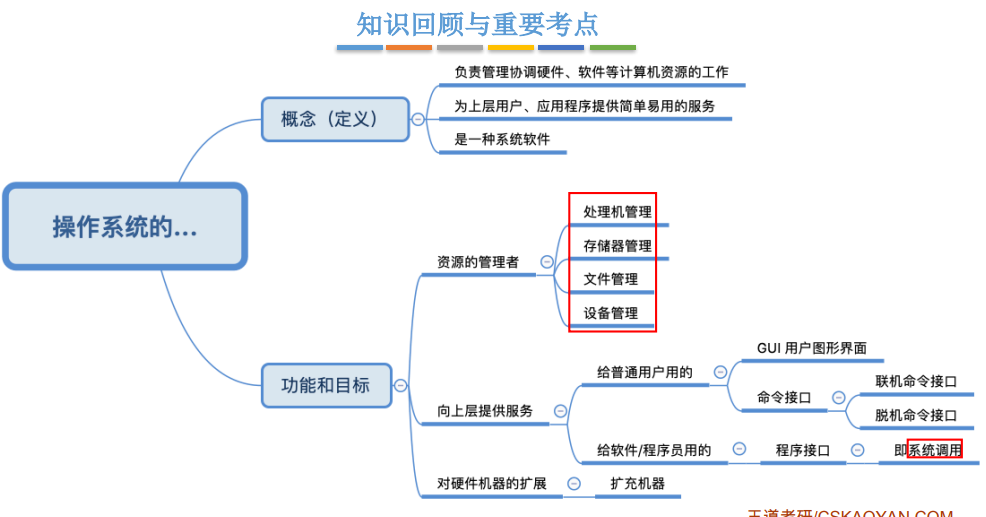

# 操作系统的特征：

## 并发

概念：计算机系统中同时运行着多个程序，宏观上是同时发生的，但是微观上是交替进行的。

意义：操作系统和程序并发是一起诞生的，操作系统就是伴随着多道口技术出现的。

注意：如果是多核CPU，是会发生真正的并行执行多个程序，但是每个cpu又在单独的并发的执行多个程序

## 共享

概念：共享即资源共享，是指系统中的资源可供内存中多个并发执行的进程共同使用。

两种资源共享的方式：

1. 互斥共享

   系统中的某些资源，虽然可以提供给多个进程使用，但是一段时间内只允许一个进程访问

2. 同时共享

   系统中的某些资源，允许一个时间段 内由多个进程“同时”对它们进行访问，同时只是宏观上的概念，微观上是进程交替对该资源进行访问

可见：如果失去并发性，则系统中只有一个 程序正在运行，则共享性失去存在的 意义 如果失去共享性，则QQ和微信不能同 时访问硬盘资源，就无法实现同时发 送文件，也就无法并发

并发和共享的关系：并发和共享互为存在条件

## 虚拟

概念：虚拟是指把一个物理上的实体变为若干个逻辑上的对应物。物理实体（前者）是实际存在的，而逻辑上 对应物（后者）是用户感受到的。

虚拟技术：

1. 空分复用技术（虚拟存储器）
2. 时分复用技术（虚拟处理器）

可见：显然，如果失去了并发性，则一个时间段 内系统中只需运行一道程序，那么就失去 了实现虚拟性的意义了。因此，没有并发 性，就谈不上虚拟性

虚拟和并发的关系：没有并发性就谈不上虚拟性

## 异步

概念：异步是指，在多道程序环境下，允许多个程序并发执行，但由于资源有限，进程的执行不是一贯到底的， 而是走走停停，以不可预知的速度向前推进，这就是进程的异步性。

可见：由于并发运行的程序会争抢着使用系统 资源，而系统中的资源有限，因此进程 的执行不是一贯到底的，而是走走停停 的，以不可预知的速度向前推进 如果失去了并发性，即系统只能串行地 运行各个程序，那么每个程序的执行会 一贯到底。

异步和并发的关系：只有系统拥有并发性，才有 可能导致异步性。

**并发和共享是操作系统最基本的两个特征**

# 进程

## 进程通信

就是进程之间的数据交互

**进程是分配系统资源的最小单位**，（包括内存地址）因此各进程拥有的内存空间相互独立

### 共享存储

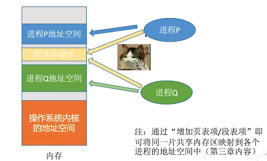

各进程对共享空间的访问是互斥的。

两种共享方式：

* 基于数据结构的共享：比如共享空间里只能放 一个长度为10的整数数组，那么就只能读写这么一个数组，而且数据只能为整数。这种共享方式速度慢、 限制多，是一种低级通信方式 （灵活性差，速度慢）
* 基于存储区的共享：在内存中画出一块共享存储区，数据的形式、存放位置都由进程控制， 而不是操作系统。相比之下，这种共享方式速度更快，是一种高级通信方式。（自由度高，速度快）

### 消息传递

进程间的数据交换以格式化的消息（Message）为单位。进程通过操作系统提供的“发送消息/接收 消息”两个原语进行数据交换。

* 直接通信方式：消息发送指明接受进程的id

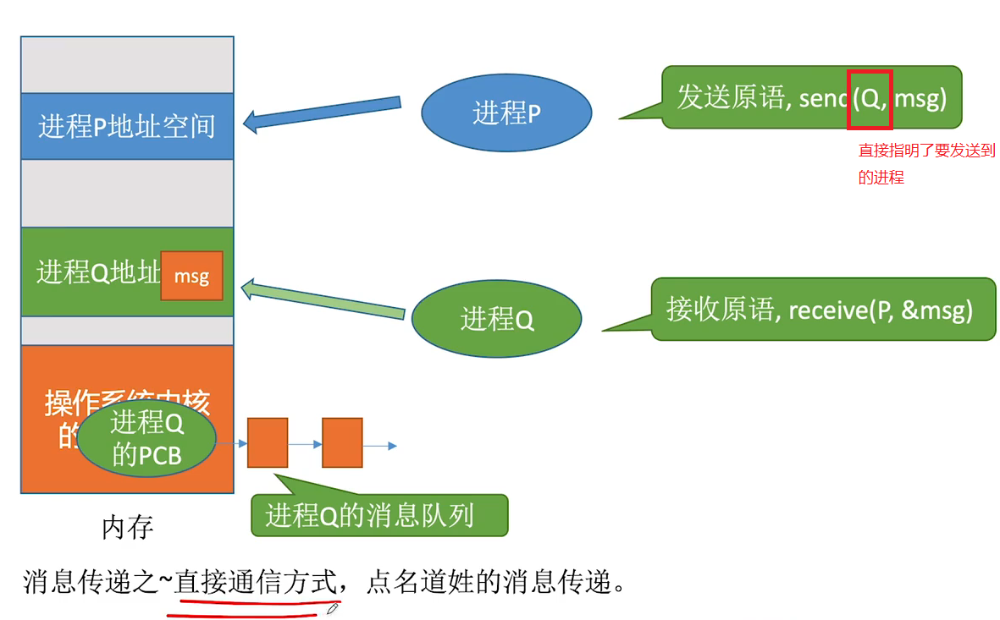

* 间接通信方式：通过“信箱”间接的通信

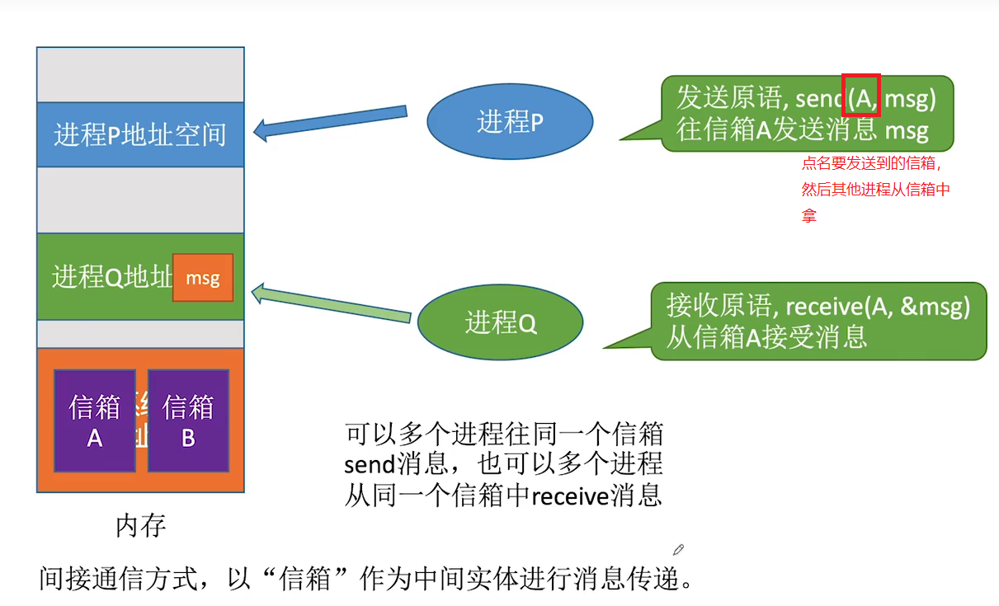

### 管道通信

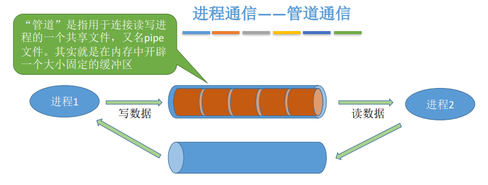

管道和共享存储的区别，共享存储读写比较自由，在一段空间中，可以在任意空闲区域读写数据，而管道是一个循环队列，符合先进先出的结构，先进的就会放在前边，也只能从前边开始读取数据。

1. 管道只能采用半双工通信，某一时间段内只能实现单向的传输。如果要实现双向同时通信，则需要设置 两个管道。 
2. 各进程要互斥地访问管道。 
3. 数据以字符流的形式写入管道，当管道写满时，写进程的write()系统调用将被阻塞，等待读进程将数据 取走。当读进程将数据全部取走后，管道变空，此时读进程的read()系统调用将被阻塞。 
4. 如果没写满，就不允许读。如果没读空，就不允许写。 
5. 数据一旦被读出，就从管道中被抛弃，这就意味着读进程最多只能有一个，否则可能会有读错数据的情况。（linux中是允许多个写进程和多个读进程的，但是系统会让各个进程轮流从管道中读取数据）

## 线程

* 进程是资源分配的最小单位，线程是cpu调度的基本单位（线程是一个基本的cpu执行单元，也是程序执行流的最小单位）
* 同一进程的各个线程共享进程拥有的资源
* 线程也支持并发，同一进程内的线程切换不会导致进程切换（减小系统开销，因为不需要切换进程的运行环境）

### 线程的实现

 多线程模型：

* 一对一模型：一个用户及线程映射到一个内 核级线程。每个用户进程有与用户级线程同 数量的内核级线程。

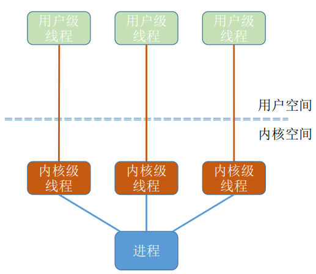

* 多对一模型：多个用户及线程映射到一个内核级线程。每个用户进程只对应一个内核级线程。

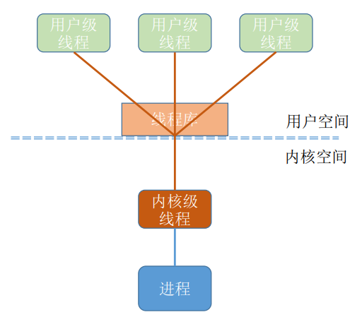

* 多对多模型：n 用户及线程映射到 m 个内核级线程（n >= m）。每个用户进程对应 m 个 内核级线程。

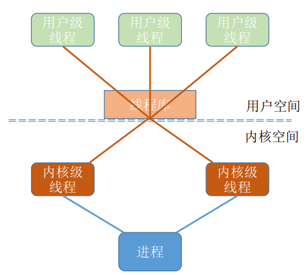

克服了多对一模型并发度不高的缺点，又克服了一对一模型中一个用户进程占用太多内核级线程，管理成本高，开销太大的缺点。进程管理开销小，效率高，且并发度高（只有所有内核级线程阻塞才会使得进程阻塞）

**用户级线程是代码逻辑的载体，内核级线程是运行机会的载体**

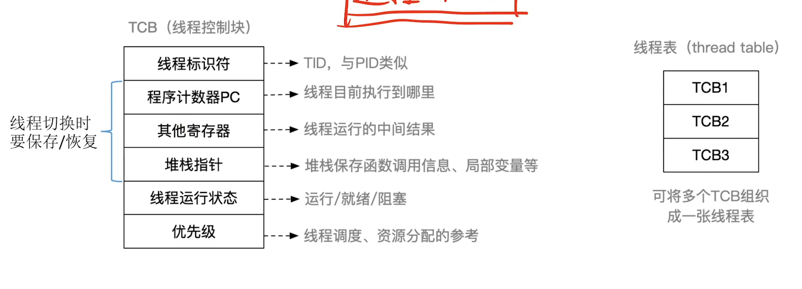

# 调度

当有一堆任务要处理，但由于**资源有限，这些事情没法同时处理**。这就需要确定某种规则来决定**处理这些任务的顺序**，这就是“调度”研究的问题。 

在多道程序系统中，进程的数量往往是多于处理机的个数的，这样不可能同时并行地处理各个进程。 处理机调度，就是从就绪队列中按照一定的算法选择一个进程并将处理机分配给它运行，以实现进程 的并发执行。

 ## 调度的层次

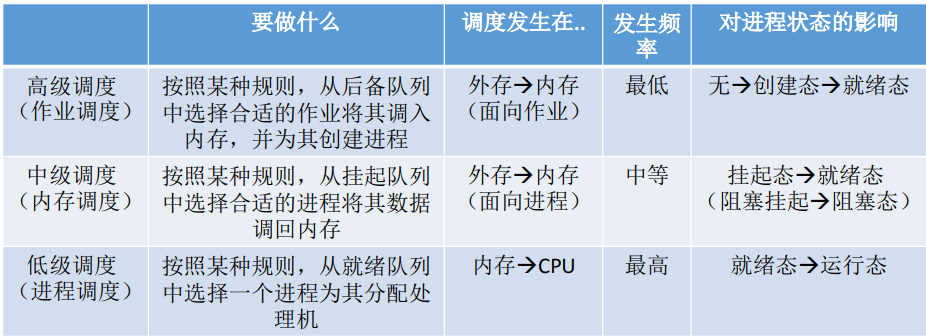

## 进程调度的时机

* 需要进程调度
  * 进程主动放弃处理机
    * 进程正常终止
    * 发生异常终止
    * 主动请求阻塞
  * 进程被动放弃处理机
    * 分给进程的时间片用完
    * 有更紧急的事情处理（I/O中断）
    * 有更高优先级的进程进入就绪队列

 

* 不能进行进程调度

  * 处理中断过程中，无法进行进程切换
  * 进程在操作系统内核程序临界区

  >临界区和内核系统临界区
  >
  >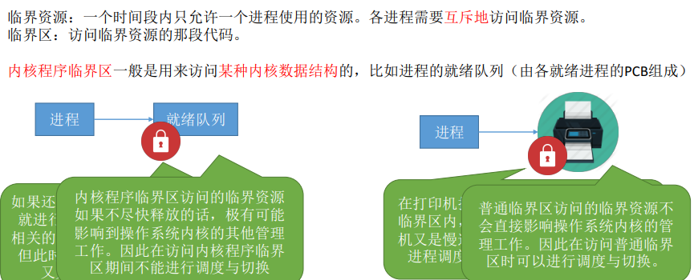

  >在打印机打印完成之前，进程一直处于临界区内，临界资源不会解锁。但打印机又是慢速设备，此时如果一直不允许进程调度的话就会导致CPU一直空闲 
  >
  >内核程序临界区访问的临界资源如果不尽快释放的话，极有可能影响到操作系统内核的其他管理工作。因此在访问内核程序临界区期间不能进行调度与切换普通临界区访问的临界资源不会直接影响操作系统内核的管理工作。因此在访问普通临界区时可以进行调度与切换。
  >
  >如果还没退出临界区（还没解锁） 就进行进程调度，但是进程调度相关的程序也需要访问就绪队列，但此时就绪队列被锁住了，因此又无法顺利进行进程调度

  * 进行原子操作的过程中（原语）

## 进程调度的方式

抢占式

非抢占式

## 调度器和闲逛进程

调度器也叫调度程序

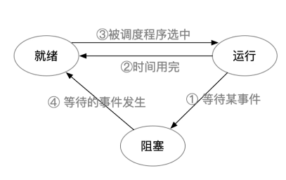

②和③是由调度程序引起的，调度程序决定了谁允许和运行多久的问题，也就是调度算法和给不同进程分配多大时间片

触发调度程序：

1. 创建新进程
2. 进程退出
3. 运行进程阻塞
4. I/O中断发生（唤醒某些阻塞进程）

如果是非抢占式的调度策略只有发生了2,3才会触发调度程序

抢占式的调度策略，每个时钟中断或k个时钟中断就会触发，因为要检查是否有新的进程进入就绪队列

闲逛进程，就是当就绪队列没有其他进程时，就会运行闲逛进程，所以CPU永远不可能空闲，优先度最低，能耗低，同样会在指令周期末尾检查中断

## 调度算法

1. 算法思想
2. 算法规则
3. 作用于作业调度还是进程调度
4. 抢占式？非抢占式？
5. 优点和缺点
6. 是否会导致饥饿（某个进程或者作业长期得不到服务）

### 先来先服务

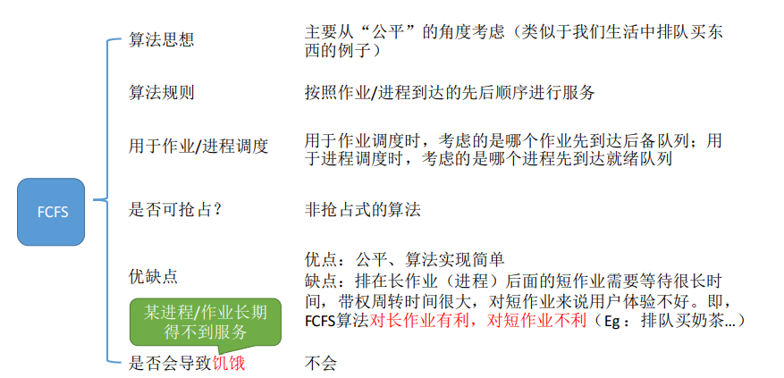

### 短作业优先：

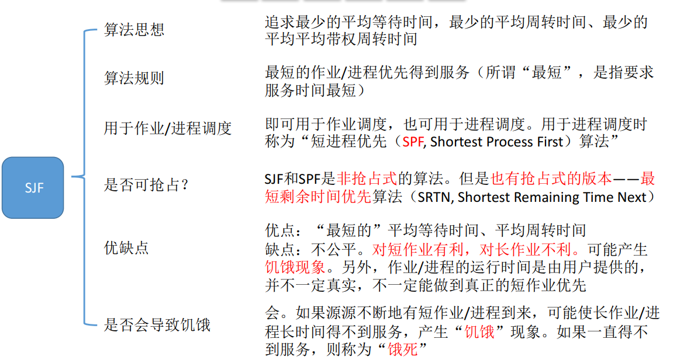

### 高响应比优先

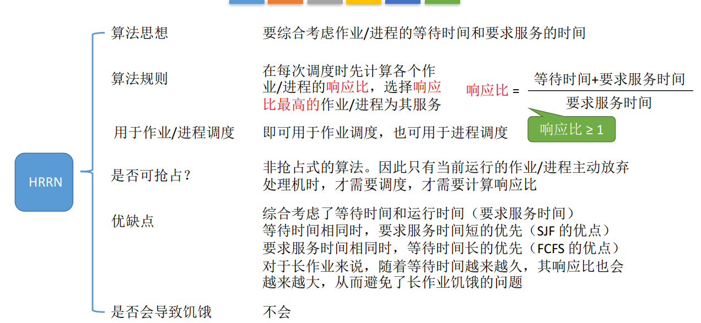

### 时间片轮转调度算法

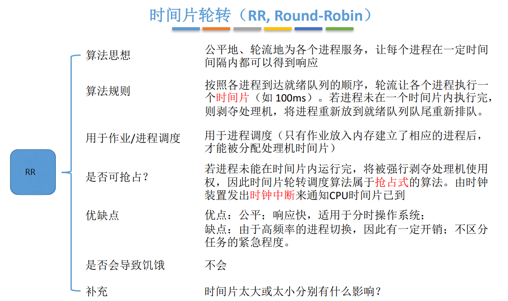

### 优先级调度算法

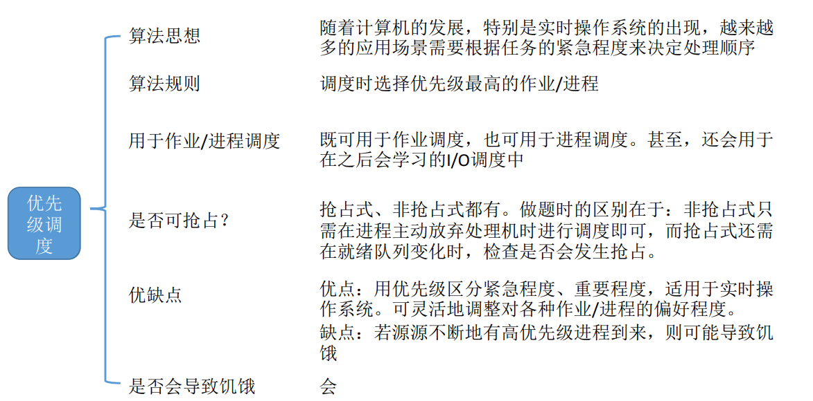

### 多级反馈队列

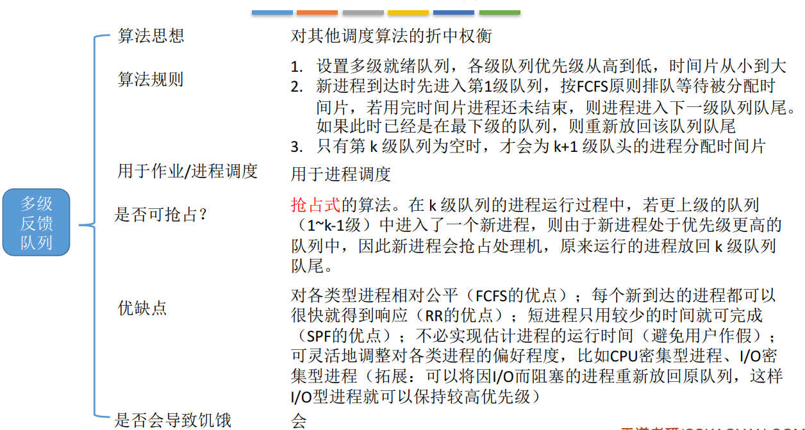

### 多级队列

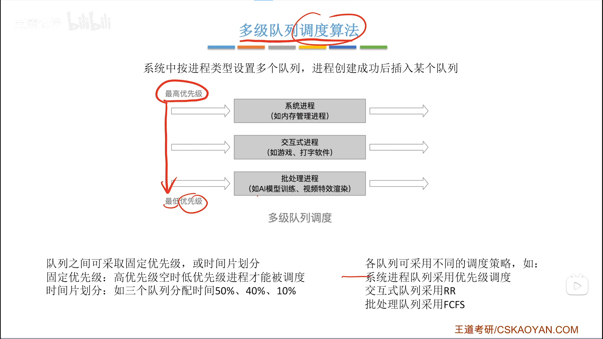

信号量机制实现进程同步，先V后P，P操作就是wait，会将对应的信号量-1，V操作就是signal操作，会将信号量+1。所以在进行生产消费问题时，只要找到会引起信号量所对应的资源的值变化的代码段然后在两边加上PV操作就好。

//P操作要先拿后用，V操作要先造后加

比如生产消费模型中，有两个同步信号量，生产会导致资源数量信号量+1，同时导致空位数量信号量-1，就在他后面加上V操作，前边加上P操作。所以个人的总结就是不管先V后P这个规律，找到会引起信号量变化的地方，在上下加上对应的操作就好

注意当缓冲区大小唯一时，不需要互斥信号量只考同步信号量也可能实现互斥访问缓冲区的功能

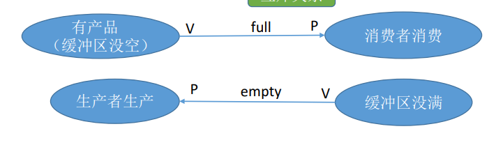

记住一个信号量只管一件事，就像在生产消费问题中，full变量只能用来判断消费者能不能继续进行消费，不能用来判断生产者能不能生产。

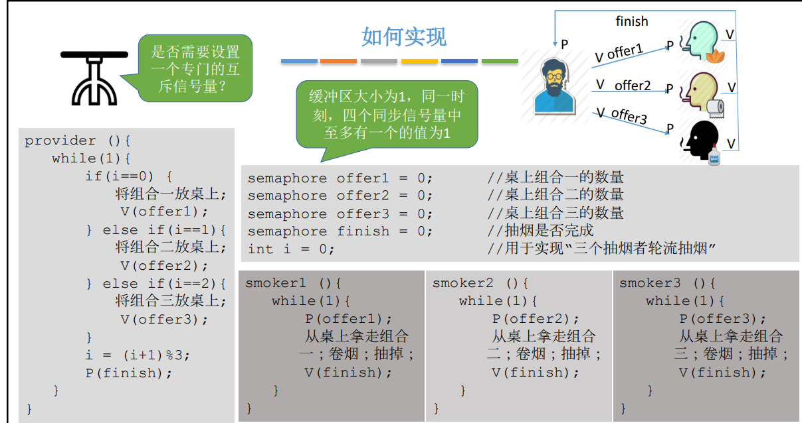

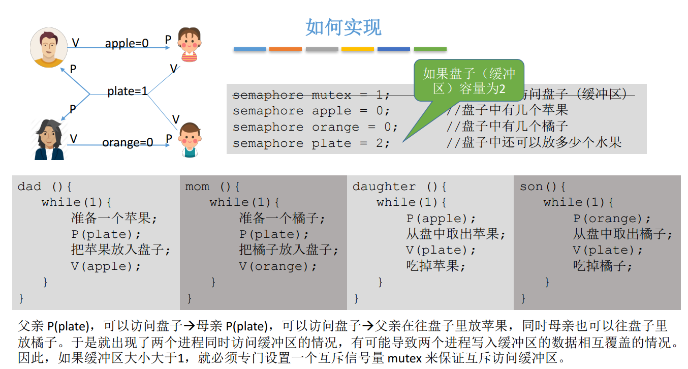

上边都是在胡言乱语：下边总结一下。

之前一直忽略了一点，那就是信号量实现同步和互斥机制有一个很重要的点，那就是要求当不满足条件时进入阻塞队列，当满足条件时，就可以直接从阻塞队列中取出然后完成剩余的代码。这不是之前的算法，这个解决了让权等待。所以结论就是要把先V后P以及自己的方法结合起来，首先看先V后P找出所有需要加入信号量的操作。然后加入PV就好，PV加入所对应代码段的位置不是固定的，要满足不会产生死锁，并且在陷入阻塞时能及时的唤醒它。就像吸烟者问题，提供者代码，将 P(finish) 放在了后边，只有这样才不会导致死锁。PV的位置取决于它们所指的对应的资源，还是满足P操作要先拿后用，V操作要先造后加。只是吸烟者问题中finish不代表一种资源的使用，更像是资源的更新。

死锁：是各进程互相等待对方手里的资源，导致各进程都阻塞，无法向前推进的现象。

银行家算法，自己的理解，为什么要先分配再判断是否安全，首先要明确需求量和最大需求量。目前如果是需求量，那么后期就有可能会再次请求资源，如果发现没有安全序列了，还给人分配了他当前的需求量就很可能造成死锁。

装入的三种方式

* 绝对装入

* 静态重定位（可重定位装入）

  * 为什么要在一个作业装入内存时，必须分配其要求的全部内存空间？

    > 个人理解：既然是由装入程序对地址进行重定位，那么如果不一次性分配完，那么如果后期再继续分配，之前的代码无法知道他的地址

* 动态重定位（动态运行时装入）

链接的三种方式

* 静态链接
* 装入时动态链接
* 运行时动态链接

# 分页分段

页表项的大小只和物理内存大小以及内存块大小有关。因为页表项指的是该页面对应的内存块的索引。所以页表项大小是固定的

段表项，有两个字段一个是段长，一个是基址，段长取决于一个段最大长度也就是段内地址的位数，基址取决于物理内存大小

可变分配局部置换：根据缺页的频率动态的增加或减少进程的物理块。频率高就增加，频率低就减少

* 何时调入页面：运行前用预调页策略进行进程的首次调入。运行时用请求调页策略，即发现缺页才将页面调入内存，但是**每次只能调入一页**，IO开销大。

* 何处调入页面：

  * 如果磁盘中交换区足够，那么就是从交换区中取出页面，在运行前要把相关的数据先复制到交换区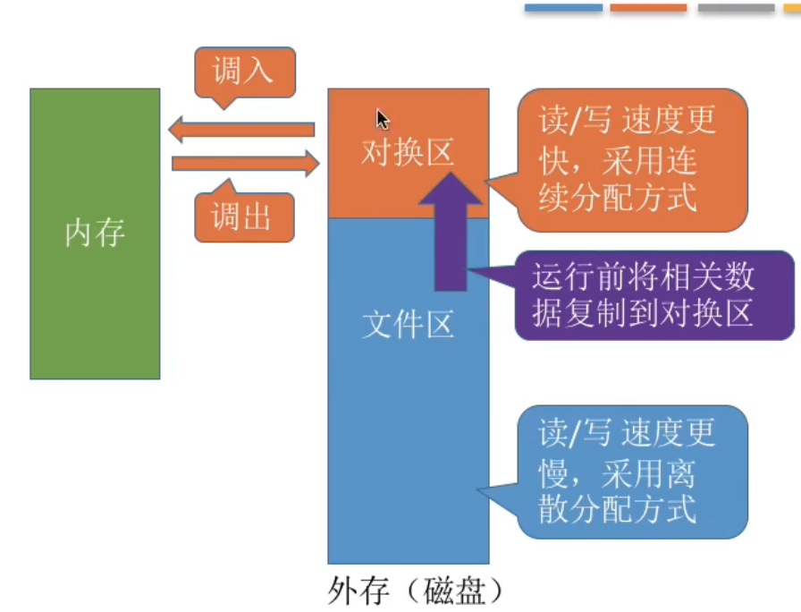
  * 如果交换区不够凡是不会被修改 的数据都直接从文件区调入，由于这些页面不 会被修改，因此换出时不必写回磁盘，下次需 要时再从文件区调入即可。对于可能被修改的 部分，换出时需写回磁盘对换区，下次需要时 再从对换区调入。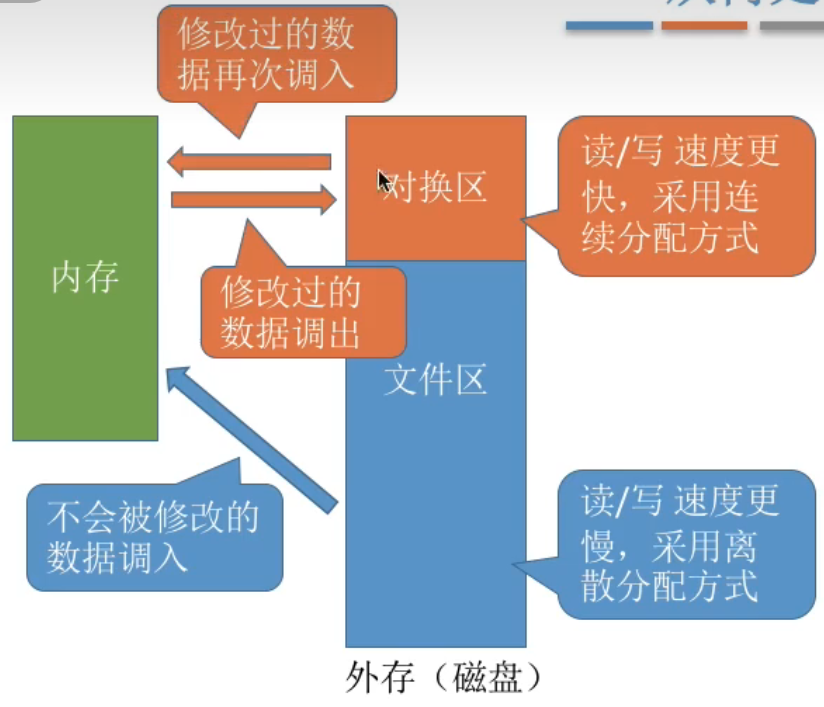

  * UNIX方式：运行之前进程有关的数据全部放在 文件区，故未使用过的页面，都可从文件区调 入。若被使用过的页面需要换出，则写回对换 区，下次需要时从对换区调入。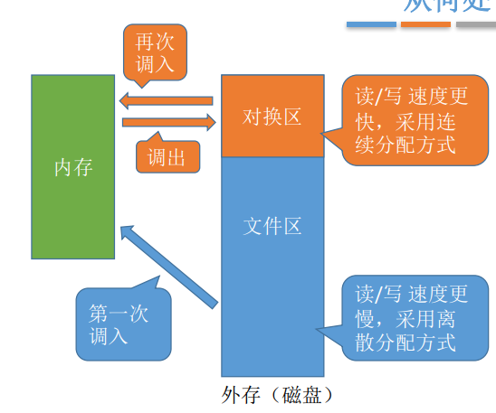

# 文件

文件的物理结构是指文件如何保存在外存中，也就是文件在物理上怎么存放怎么组织的问题

文件的逻辑结构指的是文件的各个记录在逻辑上是如何组织的问题

所谓的“逻辑结构”，就是指在用户看来， 文件内部的数据应该是如何组织起来的。而 “物理结构”指的是在操作系统看来，文件 的数据是如何存放在外存中的。

**每次磁盘I/O只能读入一块磁盘块**

内存与磁盘之间的数据交换都是以块为单位进行的，每次读入一块，每次写入一块，所以很多操作系统把内存块和磁盘块的大小设为相同大小

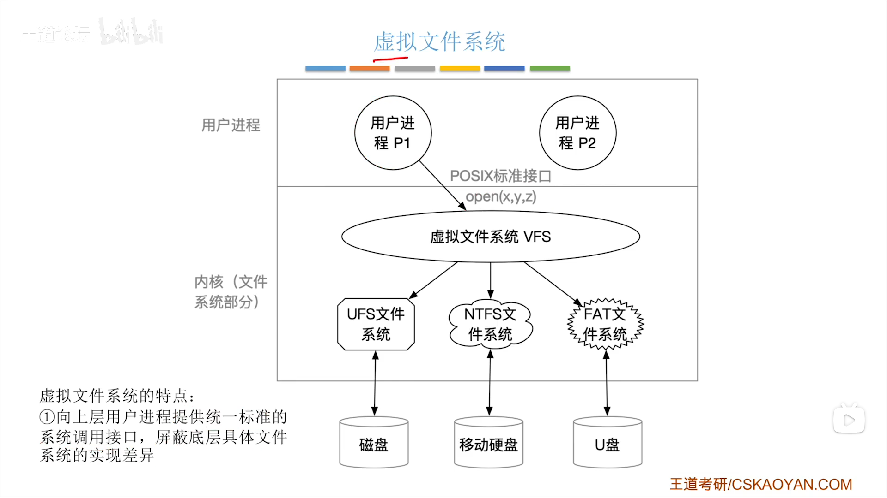

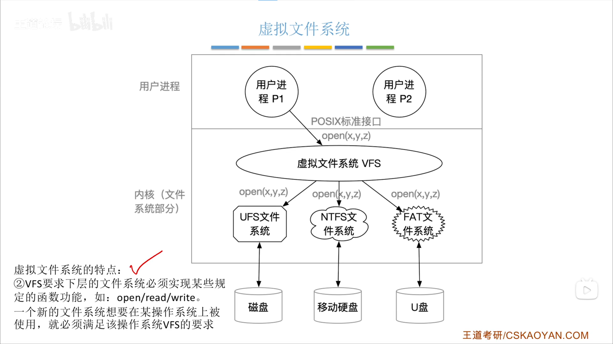

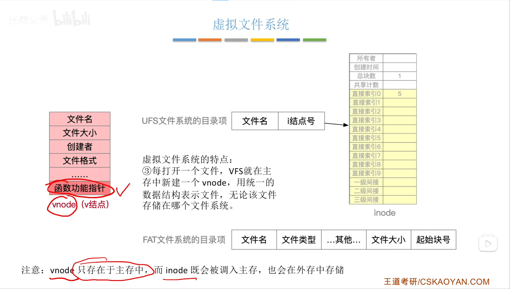

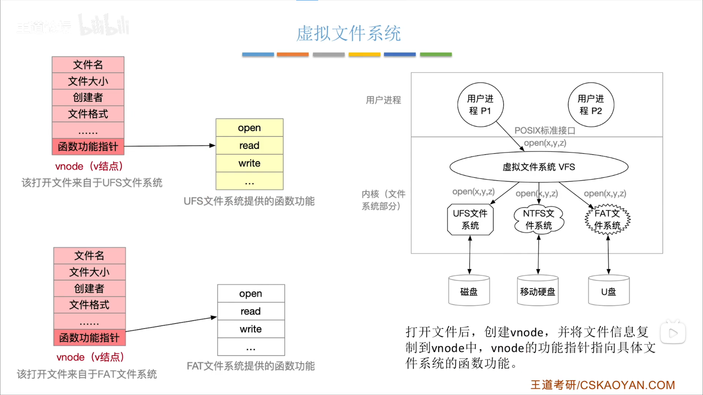

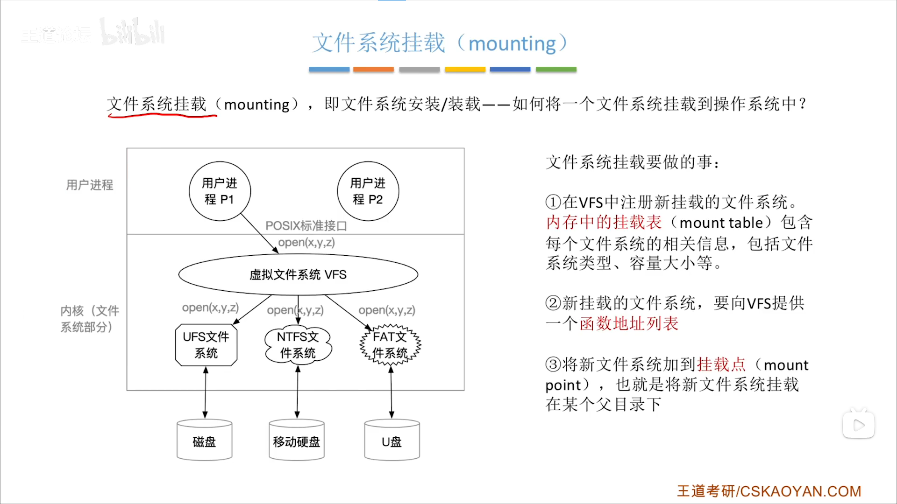

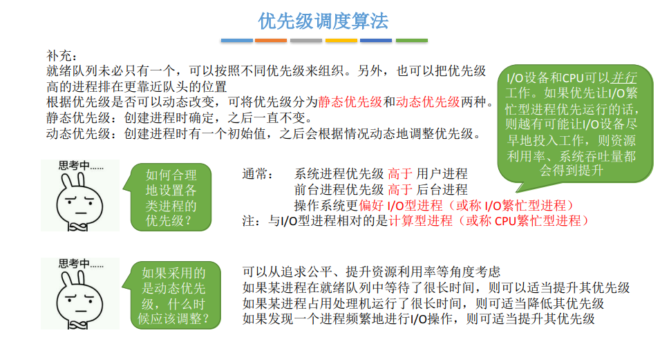

**I/O设备和CPU可以并行工作。如果优先让I/O繁 忙型进程优先运行的话， 则越有可能让I/O设备尽 早地投入工作，则资源 利用率、系统吞吐量都 会得到提升**

