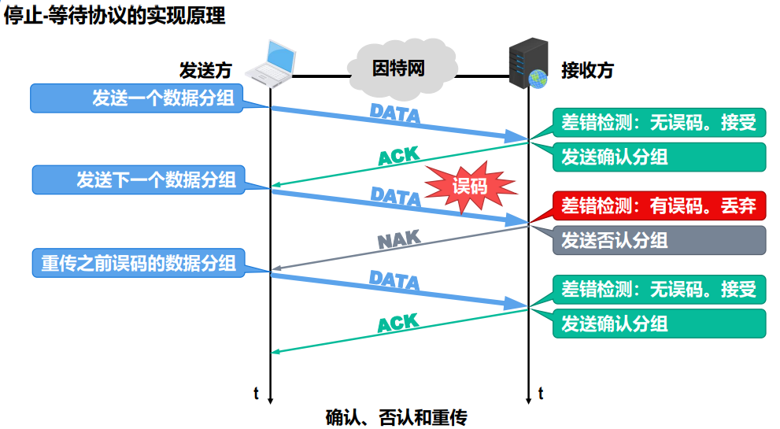
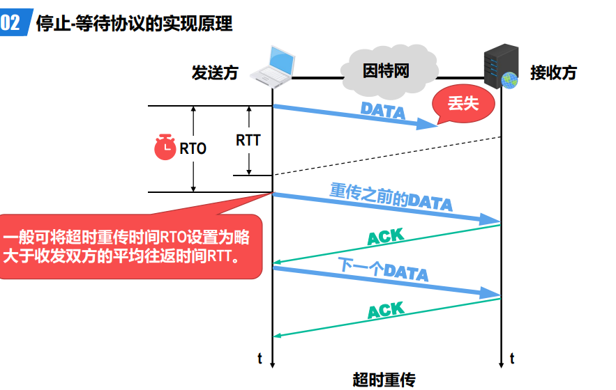
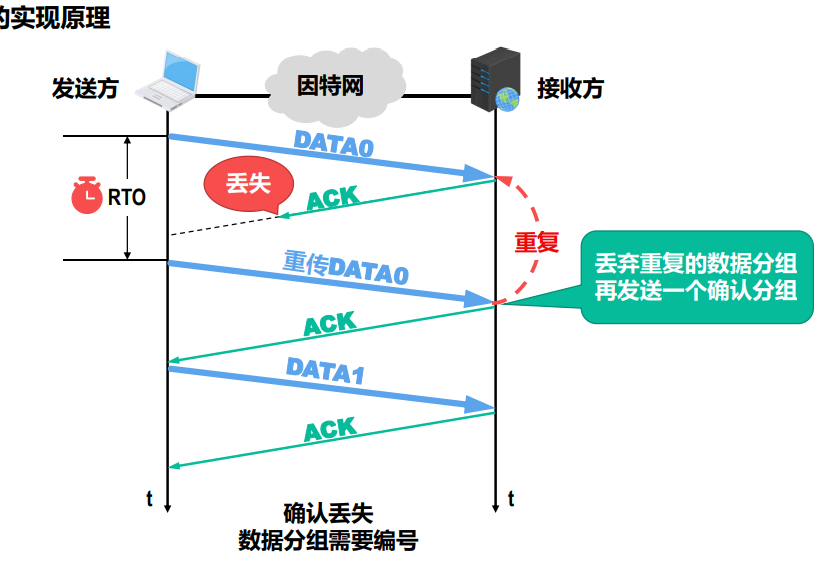

 ## 可靠传输实现的三种方法
* 可靠传输服务并不局限于数据链路层，其他各层均可选择实现可靠传输
* 可靠传输的实现比较复杂，开销比较大，是否使用可靠传输取决于应用需求

 #### 停止-等待协议
 * 误码
   
说明数据分组在发送分组之后不能将其立刻从缓存中删除，只有当接收方发送，发送方收到确认分组时才可以删除
 

* 丢失
  * 数据分组丢失
  
    * 接收方收不到数据分组，就不会发送相应的ACK或NAK。
    * 如果不采取措施，发送方就会一直处于等待接收方ACK或NAK的状态。
    * 为解决上述问题，发送方可在每发送完一个数据分组时就启动一个超时计时器（Timeout Timer）。
    * 若到了超时计时器所设置的超时重传时间（Retransmission Time- Out，RTO），但发送方仍未收到接收方的ACK或NAK，就重传之前已发送过的数据分组。
  * **确认分组丢失引起数据分组重复**
  
    * 为了避免分组重复这种传输错误，必须给每个分组带上序号。
    * 对于停止-等待协议，由于每发送一个数据分组就停止等待，只要保证每发送一个新的数据分组，其序号与上次发送的数据分组的序号不同就可以了，因此用一个比特来编号就够了，序号有0和1这两个。  
  * 

  
