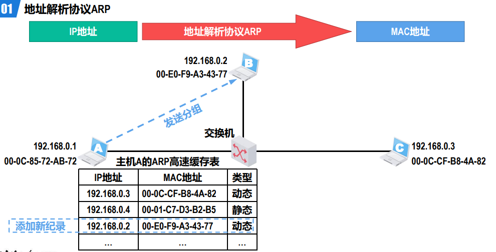
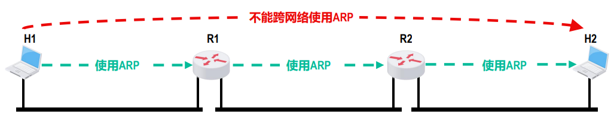
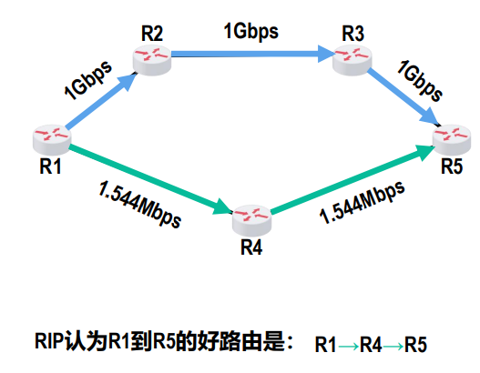

## 4.1 网络层概述

### 网络层的主要任务

网络层的主要任务就是将分组从源主机经过多个网络和多段链路传输到目的主机，可以将该任务划分为分组转发和路由选择两种重要的功能。

### 网络层向其上层提供的两种服务

* **面向连接的虚电路服务**
* **无连接的数据报服务**

#### 面向连接的虚电路服务

1. 核心思想是“可靠通信应由网络自身来保证”。
2. 必须首先建立网络层连接 —— 虚电路（Virtual Circuit，VC），以保证通信双方所需的一切网络资源。
3. 通信双方沿着已建立的虚电路发送分组。

`<u>`虚电路表示这是一条逻辑上的连接，分组沿着这条逻辑连接按照存储转发方式传送，而不是真正建立了一条物理连接；而采用电路交换的电话通信，则是先建立一条真正的物理连接。因此，分组交换的虚连接与电路交换的连接只是类似，但并不完全一样。`</u>`

*这种通信方式如果再使用可靠传输的网络协议，就可使所发送的分组最终正确（无差错按序到达、不丢失、不重复）到达接收方。*

---

#### 无连接的数据报服务

1. 核心思想是“可靠通信应由用户主机来保证”。不需要建立网络层连接。
2. 每个分组可走不同的路径。 因此，每个分组的首部都必须携带目的主机的完整地址
3. 通信结束后，没有需要释放的连接

缺点：这种通信方式所传送的分组可能误码、丢失、重复和失序。
优点：

* 由于网络自身不提供端到端的可靠传输服务，这就使得网络中的路由器可以做得比较简单，大大降低了网络造价。
* 另外，这种设计思想的运行方式灵活、能够适应多种应用。因特网能够发展到今日的规模，充分证明了当初采取这种设计思想的正确性。

**在因特网所采用的TCP/IP体系结构中网络层向其上层提供的是简单灵活的、无连接的不可靠的数据报服务，因此重点是围绕网
际层如何传送IP数据报这个主题进行介绍**

## 4.2 网际协议IP

网际协议（Internet Protocol，IP）是TCP/IP体系结构网际层中的核心协议。

与IP协议配套使用的还有四个协议，其中的ICMP和IGMP是依靠IP协议提供的服务，而IP依靠ARP和RARP(淘汰)提供的服务。

### 4.2.1 异构网络互连

**这些网络的拓扑、性能以及所使用的网络协议都不尽相同，这是由用户需求的多样性造成的，没有一种单一的网络能够适应所有用户的需求。要将众多的异构型网络都互连起来，并且能够互相通信，则会面临许多需要解决的问题。**

* 不同的网络接入机制
* 不同的差错恢复方法
* 不同的路由选择技术
* 不同的寻址方案
* 不同的最大分组长度
* 不同的服务（面向连接服务和无连接服务）

### 4.2.2 IPv4地址及其编址方法

IPv4地址是给因特网（Internet）上的每一个主机（或路由器）的每一个接口分配的一个在全世界范围内唯一的32比特的标识符。

#### IPv4地址的分类编址方法

* **A类、B类和C类地址都是单播地址，只有单播地址可以分配给网络中的主机（或路由器）的各接口。**
* **``主机号 ``为“全0”的地址是网络地址，不能分配给主机（或路由器）的各接口。**
* **``主机号 ``为“全1”的地址是广播地址，不能分配给主机（或路由器）的各接口。**

**如何区分各分类**
（1）根据地址左起第一个十进制数的值，可以判断出地址类别：
小于127为A类；
128~191为B类；
192~223为C类。
（2）根据地址类别，可以找出地址中的网络号部分和主机号部分：
A类：网络号为左起第一个字节
B类：网络号为左起前两个字节
C类：网络号为左起前三个字节
（3）以下三种情况的地址不能分配给主机或路由器的接口：
A类网络号0和127；
主机号为全0，这是网络地址；
主机号为全1，这是广播地址。

#### IPv4地址的划分子网编址方法

**``子网掩码 ``可以表明分类IPv4地址的主机号部分被借用了几个比特作为子网号。**

* 与IPv4地址类似，子网掩码也是由32比特构成的。
* **用左起多个连续的比特1对应IPv4地址中的网络号和子网号；之后的多个连续的比特0对应IPv4地址中的主机号。**
* 将划分子网的IPv4地址与相应的子网掩码进行逐比特的**逻辑与运算**，就可得到该IPv4地址所在子网的网络地址。**只要给定了一个分类的IPv4地址及其相应的子网掩码，就可以得出子网划分的全部细节。**

* C类网
* B类网：
* 默认子网掩码是指在未划分子网的情况下使用的子网掩码。

#### IPv4地址的无分类编址方法

* 无分类编址方法使用的地址掩码与划分子网使用的子网掩码类似，由32比特构成。
* 用左起多个连续的比特1对应IPv4地址中的网络前缀；
* 之后的多个连续的比特0对应IPv4地址中的主机号。

1. **使用无分类编址方法，可以根据客户的需要分配适当大小的CIDR地址块，因此可以更加有效地分配IPv4的地址空间。**
2. **使用无分类编址方法的另一个好处是路由聚合（也称为构造超网）。**

* 网络前缀越长，地址块越小，路由越具体；
* 若路由器查表转发分组时发现有多条路由条目匹配，则选择网络前缀最长的那条路由条目，这称为**最长前缀匹配**，因为这样的路由更具体。
* 路由聚合就找最长公共前缀

### 4.2.3 IPv4地址的应用规划

IPv4地址的应用规划是指将给定的IPv4地址块（或分类网络）划分成若干个更小的地址块（或子网），并将这些地址块（或子网）分配给互联网中的不同网络，进而可以给各网络中的主机和路由器的接口分配IPv4地址。

### 4.2.4 IPv4地址与MAC地址的封装位置

#### 数据报传送过程中IPv4地址与MAC地址的变化情况

**在数据包的传送过程中，数据包的源IP地址和目的IP地址保持不变；**
**在数据包的传送过程中，数据包的源MAC地址和目的MAC地址逐链路（或逐网络）改变。**

### 4.2.5 地址解析协议ARP

``$~~~~~~~~~~~~~\Downarrow$``

``$~~~~~~~~~~~~~\Downarrow$``

``$~~~~~~~~~~~~~\Downarrow$``

``$~~~~~~~~~~~~~\Downarrow$``

==ARP协议只能在一段链路上使用，不能跨链路使用==

### 4.2.6 IP数据报的发送和转发过程

**IP数据报的发送和转发过程包含以下两个过程：**

* 主机发送IP数据报
* 路由器转发IP数据报

### 4.2.7 IPv4数据报的首部格式

* IPv4数据报的首部格式及其内容是==实现IPv4协议各种功能的基础。==
* 在TCP/IP标准中，==各种数据格式常常以``32比特（即4字节）``为单位来描述。==

> 
>
> * 固定部分是指每个IPv4数据报都必须要包含的部分。
> * 某些IPv4数据报的首部，除了包含20字节的固定部分，还包含一些可选的字段来增加IPv4数据报的功能。

#### 版本

长度为==4个比特==，用来表示IP协议的版本。
==通信双方使用的IP协议的版本必须一致==。目前广泛使用的IP协议的版本号为4（即IPv4）。

#### 首部长度

==长度为4个比特，该字段的取值以4字节为单位==，用来表示IPv4数据报的首部长度。
**最小取值为二进制的0101，即十进制的5，==再乘以4字节单位==，表示IPv4数据报首部只有20字节固定部分。**
**最大取值为二进制的1111，即十进制的15，再乘以4字节单位，表示IPv4数据报首部包含20字节固定部分和最大40字节可变部分。**

#### 可选字段

长度从1字节到40字节不等，用来支持排错、测量以及安全措施等功能。
虽然可选字段增加了IPv4数据报的功能，但这同时也使得IPv4数据报的首部长度成为可变的，这就增加了因特网中每一个路由器处理IPv4数据报的开销。
实际上，可选字段很少被使用。

#### 填充

用来确保IPv4数据报的首部长度是4字节的整数倍，使用全0进行填充。
当首部长度（20字节固定部分+可变部分）的长度不是4字节整数倍时，填充相应数量的全0字节，==以确保IPv4数据报的首部长度是4字节的整数倍。==

#### 区分服务

长度为8个比特，用来获得更好的服务。
该字段在旧标准中叫作服务类型，但实际上一直没有被使用过。
1998年，因特网工程任务组IETF把这个字段改名为区分服务。
利用该字段的不同取值可提供不同等级的服务质量。
只有在使用区分服务时该字段才起作用，一般情况下都不使用该字段。

#### 总长度

**长度为16个比特，该字段的取值以字节为单位，用来表示IPv4数据报的长度（首部长度+数据载荷长度）。**
最大取值为二进制的16个比特1，即十进制的65535（很少传输这么长的IPv4数据报）。

##### 总长度和首部长度

#### 标识&&标志&&片偏移

**共同用于IPv4数据报分片**

##### IPv4数据报分片的概念

MTU：长度受限于最大传送单元MTU，例如，以太网规定MTU的取值为1500字节
当IPv4数据报长度超过MTU时，无法封装成帧，需要将原IPv4数据报分片为若干个更小的IPv4数据报

##### 标识

长度为16个比特，属于同一个IPv4数据报的各分片数据报应该具有相同的标识。IP软件会维持一个计数器，每产生一个IPv4数据报，计数器值就加1，并将此值赋给标识字段。

##### 标志

* 最低位（More Fragment，MF）
  * MF=1表示本分片后面还有分片
  * MF=0表示本分片后面没有分片
* 中间位（Don’t Fragment，DF）
  * DF=1表示不允许分片
  * DF=0表示允许分片
* 最高位为保留位，必须设置为0

##### 片偏移

长度为13个比特，==**该字段的取值以8字节为单位**，用来指出分片IPv4数据报的数据载荷偏移其在原IPv4数据报的位置有多远。==

#### 生存时间（Time To Live，TTL）

长度为8个比特，最大取值为二进制的11111111，即十进制的255。该字段的取值最初以秒为单位。因此，IPv4数据报的最大生存时间最初为255秒。路由器转发IPv4数据报时，将其首部中该字段的值减去该数据报在路由器上所耗费的时间，若结果不为0就转发，否则就丢弃。
生存时间字段后来改为以“跳数”为单位，**路由器收到待转发的IPv4数据报时，将其首部中的该字段的值减1，若结果不为0就转发，否则就丢弃。**

> 【举例】生存时间TTL字段的作用 —— 防止被错误路由的IPv4数据报无限制地在因特网中兜圈
> 

#### 协议

长度为8个比特，用来指明IPv4数据报的 ``数据载荷是何种协议数据单元PDU。``

#### 首部检验和

长度为16个比特，用于检测IPv4数据报在传输过程中其首部是否出现了差错。
IPv4数据报每经过一个路由器，其首部中的某些字段的值（例如生存时间TTL、标志以及片偏移等）都可能发生变化，因此路由器都要重新计算一下首部检验和。
具体检错方法自行搜索
==由于网际层并不向其高层提供可靠传输的服务，并且计算首部检验和是一项耗时的操作，因此在IPv6中，路由器不再计算首部检验和，从而更快转发IP数据报。==

#### 源IP地址

长度为32个比特，用来填写发送IPv4数据报的源主机的IPv4地址。

#### 目的IP地址

长度为32个比特，用来填写接收IPv4数据报的目的主机的IPv4地址。

## 4.3静态路由配置

静态路由配置是指用户或网络运维人员使用路由器的相关命令给路由器人工配置路由表。
人工配置方式简单、开销小、但不能及时适应网络状态（流量、拓扑等）的变化，一般只在小规模网络中采用。

## 4.4 因特网的路由选择协议

### 4.4.1 路由选择分类

* **静态路由选择**
  * 采用**人工配置**的方式给路由器添加网络路由、默认路由和特定主机路由等路由条目。
  * 静态路由选择**简单、开销小，但不能及时适应网络状态（流量、拓扑等）的变化。**
  * 静态路由选择一般只在**小规模网络**中采用。
* **动态路由选择**
  * 路由器通过路由选择协议**自动获取**路由信息。
  * 动态路由选择**比较复杂、开销比较大，但能较好地适应网络状态的变化。**
  * 动态路由选择适用于**大规模网络。**

### 4.4.2 因特网采用分层次的路由选择协议

因特网是全球最大的互联网，它所采取的路由选择协议具有以下三个主要特点：

1. ==因特网中的各路由器通过相互间的信息交互，共同完成路由信息的获取和更新。==
2. 将整个因特网划分为许多较小的自治系统（Autonomous System，AS）。**在自治系统内部和外部采用不同类别的路由选择协议，分别进行路由选择。**
3. **因特网采用==动态路由==选择**，能较好地适应网络状态的变化。

### 4.4._ 学习协议之前要先明确的一点

[路由器所运行的每种路由协议也维护着该协议自己的路由表。](http://t.csdn.cn/uR4Zm)

[与其他路由协议一样ospf也有自己的路由表](https://zhidao.baidu.com/question/539600190.html)

**上边两句话可以得出每个路由协议的路由表并不相同。**

### 4.4.3 路由信息协议

#### 01 路由信息协议RIP的相关基本概念

**路由信息协议（Routing Information Protocol，RIP）** 是内部网关协议中最先得到广泛使用的协议之一，其相关标准文档为[RFC 1058]。
RIP要求自治系统AS内的每一个路由器，都要维护从它自己到AS内其他每一个网络的距离记录。这是一组距离，称为**距离向量**（Distance-Vector，D-V）。
**RIP使用跳数（Hop Count）作为度量（Metric）来衡量到达目的网络的距离。**

* **RIP将路由器到直连网络的距离定义为1。**
* **RIP将路由器到非直连网络的距离定义为所经过的路由器数加1。**
* **RIP允许一条路径最多只能包含15个路由器，距离等于16时相当于不可达。因此RIP只适用于小型互联网。**
  
==**RIP认为好的路由就是“距离短”的路由，也就是所通过路由器数量最少的路由。**==
  
==**当到达同一目的网络有多条RIP距离相等的路由时，可以进行等价负载均衡，也就是将通信量均衡地分布到多条等价的路径上。**==
  

#### 02 RIP的基本工作过程

#### 03 RIP的距离向量算法

#### 04 RIP存在的问题

#### 05 RIP版本和相关报文的封装

#### 06 RIP的优缺点

### 4.4.4 开放最短路径优先协议

### 4.4.5 边界网关协议

### 4.4.6 路由器的基本工作原理
